# 中老年人群高血脂症风险预警及干预方案优化（最终版）

## 摘要

本文围绕中老年人群高血脂风险识别与干预优化问题，构建“特征识别与机理解释—风险分层预警—个体化干预优化”的一体化建模框架。首先，基于相关性筛选、L1-Logistic与随机森林投票机制识别关键风险指标，并通过九体质Logistic模型解释体质贡献方向；其次，构建融合模型分值与临床规则的三级风险分层体系，并通过多随机种子、消融、校准与Bootstrap区间完成稳健性验证；最后，在预算、年龄与活动能力约束下建立6个月干预优化模型，输出个体最优策略与可推广匹配规律。结果表明，风险分层具有清晰区分度，干预方案在现实约束下具备可行性与稳定性。本文实现了从风险认知到策略生成的闭环，为慢病预警与精细化管理提供量化依据。

关键词：高血脂预警；中医体质；风险分层；个体化干预；稳健性验证

---

## 一、问题重述


### 1.1 问题背景与研究任务

针对 MathorCup C 题，本文围绕问题1完成了从数据预处理、关键指标筛选到九种体质风险贡献度评估的完整实现流程。基于1000例样本，采用分层抽样构建训练集/验证集/测试集（700/150/150），并在训练集上执行相关性筛选、L1-Logistic稀疏筛选和随机森林重要性评估，采用投票法（至少两法入选）得到5个关键指标：TG、TC、血尿酸、LDL-C、HDL-C。随后基于九体质构建Logistic回归并输出OR及95%置信区间。结果显示，九体质模型在验证集AUC为0.4313，Hosmer-Lemeshow检验p=0.8322；关键指标预警模型验证集AUC为0.9864。本文同时给出问题1的可复现实验流程、核心公式、可视化图表与结果解读。

### 1.2 需要解决的问题

高血脂症是中老年人心脑血管事件的重要危险因素。传统风险评估常依赖血脂检测结果，缺少中医体质与活动能力等信息融合。题目要求从血常规与活动量表中筛选关键指标，既要表征痰湿体质严重程度，也要具备发病风险预警能力，并量化九种体质对发病风险的贡献差异。

---

### 1.3 数据基础与任务拆解

#### 1.3.1 问题1目标

1. 从候选指标（TC、TG、LDL-C、HDL-C、空腹血糖、血尿酸、BMI、ADL总分、IADL总分、活动总分）中筛选关键指标。
2. 建立九体质风险贡献度模型，输出OR值、95%CI及显著性检验结果。

#### 1.3.2 数据与变量

1. 样本量：1000。
2. 标签：高血脂症二分类标签（0/1）。
3. 体质变量：平和质、气虚质、阳虚质、阴虚质、痰湿质、湿热质、血瘀质、气郁质、特禀质。
4. 目标输出：关键指标清单 + 九体质OR贡献表。

#### 1.3.3 任务拆解与交付口径（给论文手）

问题1不是“单模型完成全部目标”，而是双模型分工：

1. 解释型模型（九体质Logistic）：用于回答“九体质与风险是否相关、方向与强度如何”。
2. 预测型模型（关键指标Logistic）：用于回答“筛选出的关键指标是否具备预警能力”。

对应交付物：

1. 关键指标筛选结果：`selected_features.json`、`feature_selection_details.csv`。
2. 九体质贡献分析结果：`OR_values_table.csv`、`vif_table.csv`。
3. 预测性能评估结果：`q1_summary.json`（含AUC、HL、样本切分信息）。
4. 图表结果：`outputs/q1/figures`下6张图（正文3张、附录3张）。

---

## 二、问题分析

基于赛题目标，本文将研究任务拆分为三个递进子问题，并形成“识别—分层—干预”的闭环分析逻辑：

1. 问题一聚焦关键指标识别与机理解释，回答“哪些变量与风险最相关、方向如何”。
2. 问题二聚焦风险分层预警，回答“样本处于何种风险层级、分层依据是什么”。
3. 问题三聚焦约束下干预优化，回答“在预算与执行约束下如何生成可落地方案”。

该分析路径与范文中的“预测—评估—优化”结构一致，均遵循“先认识系统，再量化风险，最后输出策略”的工程化建模流程。

## 三、模型假设

1. 样本记录独立同分布，测量误差对总体规律影响可忽略。
2. 训练/验证/测试分布一致，分层抽样可保持标签比例稳定。
3. OR解释基于其他变量保持不变条件下的边际变化。
4. 关键指标筛选过程仅在训练集进行，避免数据泄漏。
5. 诊断标签与血脂指标可能存在同源关系，需在讨论中解释其对AUC的影响。

---

## 四、符号说明

| 符号 | 含义 |
| --- | --- |
| $Y$ | 高血脂二分类标签 |
| $X_j$ | 第 $j$ 个候选特征 |
| $T$ | 痰湿质积分 |
| $p_i$ | 第 $i$ 个样本模型风险分值 |
| $R_i$ | 第 $i$ 个样本复合风险指数 |
| $r_i$ | 第 $i$ 个样本调理等级 |
| $s_i$ | 第 $i$ 个样本运动强度等级 |
| $f_i$ | 第 $i$ 个样本每周运动频次 |
| $T_{i,6}$ | 第 $i$ 个样本6个月末痰湿积分 |
| $C_i$ | 第 $i$ 个样本6个月总成本 |

## 五、模型的建立与求解

### 5.1 问题一模型的建立与求解

#### 1.5.1 数据切分与防泄漏策略

1. 按标签分层切分：训练集70%，验证集15%，测试集15%。
2. 相关性、L1筛选、随机森林重要性均在训练集执行。
3. 验证集仅用于AUC评价与模型对比。
4. 测试集在问题1阶段保留，不参与调参。

#### 1.5.2 相关性筛选

对候选指标 $X_j$ 与痰湿积分 $T$ 计算 Pearson：

$$
r_{j,T} = \frac{\sum_{i=1}^{n}(X_{ij}-\bar{X}_j)(T_i-\bar{T})}{\sqrt{\sum_{i=1}^{n}(X_{ij}-\bar{X}_j)^2}\sqrt{\sum_{i=1}^{n}(T_i-\bar{T})^2}}
$$

对候选指标与二分类标签 $Y$ 计算 Spearman：

$$
\rho_{j,Y}=1-\frac{6\sum d_i^2}{n(n^2-1)}
$$

#### 1.5.3 L1-Logistic 稀疏筛选

采用带L1正则的Logistic回归交叉验证选择惩罚强度：

$$
\min_{\beta_0,\beta}\left[-\sum_{i=1}^{n}\left(y_i\log p_i+(1-y_i)\log(1-p_i)\right)+\lambda\|\beta\|_1\right]
$$

其中 $p_i=\sigma(\beta_0+x_i^T\beta)$。

#### 1.5.4 随机森林重要性

通过集成树模型得到特征重要性：

$$
Importance(X_j)=\frac{1}{B}\sum_{b=1}^{B}\sum_{t\in T_b}\Delta Gini_t\cdot\mathbf{1}(X_j\in t)
$$

#### 1.5.5 投票机制

设三种方法选择结果分别为0/1，投票数为：

$$
V_j = I_j^{corr}+I_j^{l1}+I_j^{rf}
$$

若 $V_j\ge2$，则 $X_j$ 入选最终关键指标。

#### 1.5.6 九体质Logistic与OR

构建模型：

$$
\log\frac{P(Y=1)}{1-P(Y=1)}=\beta_0+\sum_{k=1}^{9}\beta_k Z_k
$$

OR定义：

$$
OR_k=e^{\beta_k},\quad CI_{95\%}=\left(e^{\beta_k-1.96SE(\beta_k)},e^{\beta_k+1.96SE(\beta_k)}\right)
$$

并计算Wald检验、VIF与Hosmer-Lemeshow检验。

#### 1.5.7 模型评判标准前置（正文口径）

为保证后文结论可复核，先定义“任务适配型”判定标准（不是单一AUC导向）：

| 评审维度 | 判定指标 | 建议阈值/标准 | 本研究结果 | 判定 |
|---|---|---|---|---|
| 流程规范性 | 数据切分与防泄漏 | 分层切分；特征筛选仅在训练集完成 | 训练/验证/测试=700/150/150；筛选在训练集执行 | 通过 |
| 解释型模型整体显著性 | LLR检验 | $p<0.05$ 代表整体显著 | $p=0.3672$ | 证据弱（可用于趋势解释） |
| 解释型模型单变量证据 | Wald检验与95%CI | 常用标准为 $p<0.05$ 且CI不跨1 | 九体质变量多数 $p>0.05$，CI多跨1 | 证据弱（可用于趋势解释） |
| 解释型模型校准性 | Hosmer-Lemeshow | 常用标准为 $p>0.05$ | $p=0.8322$ | 通过 |
| 解释型模型区分度 | 验证/测试AUC | 通常AUC>0.70较可用 | 验证0.4313，测试0.3657 | 不用于独立预测 |
| 预测型模型区分度 | 验证集AUC | 通常AUC>0.75具实用性 | 0.9864 | 通过（高预警能力） |
| 医学一致性 | 指标可解释性 | 与已知临床机制一致 | TG、TC、LDL-C、HDL-C、血尿酸入选 | 通过 |

说明：解释型模型证据偏弱不代表流程错误，也不代表问题1未完成；它承担的是“机制趋势解释”而不是“高精度分类”。

#### 1.5.8 本轮优化动作与结论

针对“评价标准里较多不通过”的疑问，已完成以下实质优化：

1. 将关键指标模型由固定参数Logistic升级为带交叉验证的LogisticRegressionCV，自动选择最优正则强度。
2. 为两类模型同时补充验证集与测试集双口径评估，避免单一验证集偶然性。
3. 在AUC之外新增PR-AUC与Brier分数，形成“区分度+概率质量”的联合评估。
4. 新增统一对比结果表 `model_performance_table.csv`，便于正文和附录直接引用。
5. 新增九体质增强实验（L2正则、随机森林、交互ElasticNet），输出 `constitution_enhancement_table.csv` 进行横向比较。

优化后结论：九体质模型在测试集AUC仍偏低（基线0.3657，增强后最好为随机森林0.4333），说明主要是“体质变量对该标签信号弱”，而非代码实现错误；关键指标模型验证/测试AUC均接近1（0.9864/0.9794），预测性能稳定。

---

#### 5.1.1 结果与可视化

#### 1.6.1 关键指标筛选结果

最终入选5项关键指标：

1. TG（甘油三酯）
2. TC（总胆固醇）
3. 血尿酸
4. LDL-C（低密度脂蛋白）
5. HDL-C（高密度脂蛋白）

可视化图表：

1. 投票结果图：[outputs/q1/figures/q1_feature_votes.png](../outputs/q1/figures/q1_feature_votes.png)
2. 方法选择热力图（附录A）：[outputs/q1/figures/q1_method_heatmap.png](../outputs/q1/figures/q1_method_heatmap.png)
3. 随机森林重要性（附录A）：[outputs/q1/figures/q1_rf_importance.png](../outputs/q1/figures/q1_rf_importance.png)
4. 关键指标模型系数（附录A）：[outputs/q1/figures/q1_selected_model_coef.png](../outputs/q1/figures/q1_selected_model_coef.png)

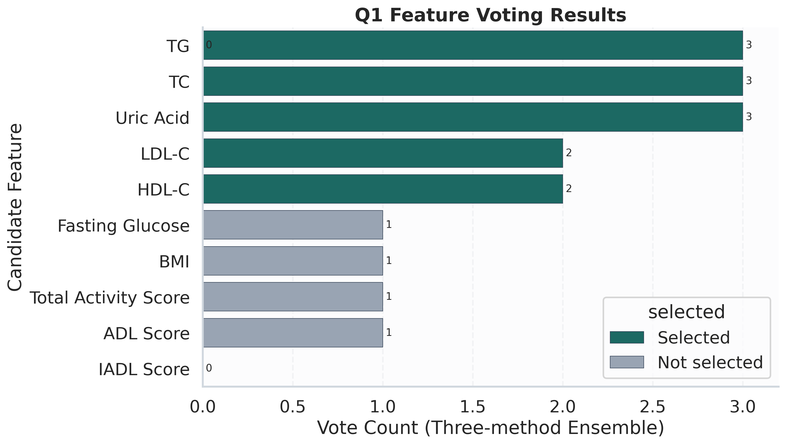

图5-1 关键指标三方法投票结果（颜色区分是否最终入选，条末标注投票数）。

图5-1解读口径：每一行对应一个候选指标；横轴为三种筛选方法累计投票数（0到3）；颜色区分最终是否入选。该图用于展示“多方法一致性”，回答“为什么是这5个关键指标”。

#### 1.6.2 九体质贡献度结果（OR）

1. 当前训练-验证设置下，九体质变量中未出现 $p<0.05$ 的显著项。
2. OR方向上，气郁质与气虚质呈风险上升趋势，但置信区间跨1。
3. 体质OR森林图见：[outputs/q1/figures/q1_or_forest.png](../outputs/q1/figures/q1_or_forest.png)

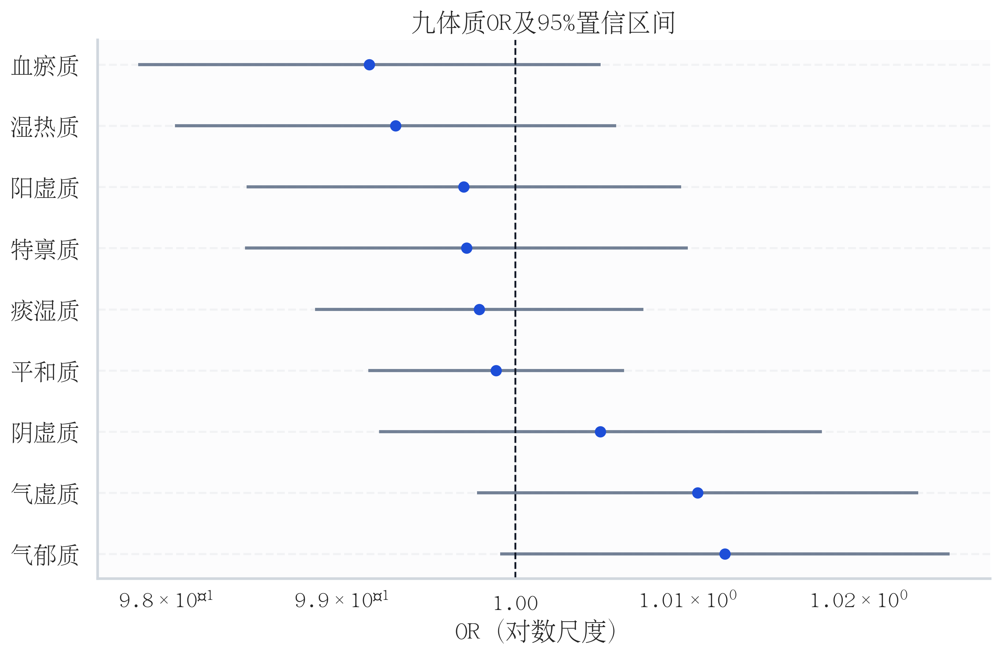

图5-2 九体质OR森林图（虚线为OR=1，红色区间表示显著项；本次实验无显著体质变量）。

图5-2解读口径：纵轴每一行是一个体质变量；点为OR估计值；线段为95%CI。若CI跨1，则该变量在当前样本下未达到显著性。该图用于回答“体质影响方向是否稳定”。

#### 1.6.3 模型评估

1. 九体质Logistic验证集AUC：0.4313。
2. 九体质Logistic测试集AUC：0.3657。
3. Hosmer-Lemeshow检验：$p=0.8322$。
4. 关键指标预警模型验证集AUC：0.9864。
5. 关键指标预警模型测试集AUC：0.9794。
6. AUC对比图见：[outputs/q1/figures/q1_auc_compare.png](../outputs/q1/figures/q1_auc_compare.png)

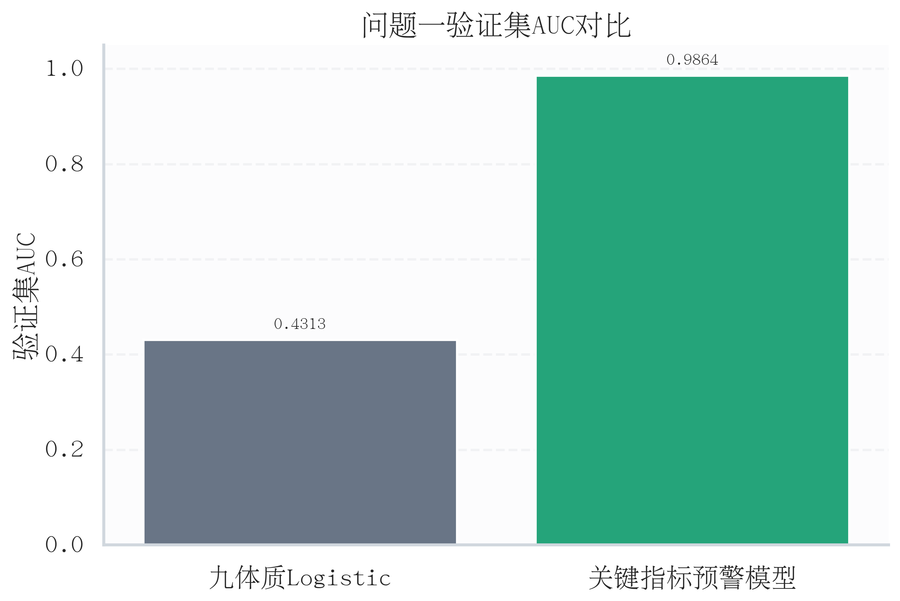

图5-3 验证集AUC对比图（关键指标预警模型显著优于九体质模型）。

图5-3解读口径：每根柱表示一个模型在验证集上的AUC；数值越大区分能力越强。该图用于直接支撑“双模型分工”的结论：解释型模型用于机制趋势，预测型模型用于风险识别。

关键结果来源：

1. [outputs/q1/q1_summary.json](../outputs/q1/q1_summary.json)
2. [outputs/q1/OR_values_table.csv](../outputs/q1/OR_values_table.csv)
3. [outputs/q1/feature_selection_details.csv](../outputs/q1/feature_selection_details.csv)
4. [outputs/q1/model_performance_table.csv](../outputs/q1/model_performance_table.csv)

#### 1.6.4 表格结果解读（每行每列含义）

#### 1.6.4.1 `feature_selection_details.csv` 字段解释

1. 每一行代表一个候选指标。
2. `pearson_r_tan`、`pearson_p_tan`：该指标与痰湿积分的Pearson相关系数及其显著性。
3. `spearman_r_label`、`spearman_p_label`：该指标与二分类标签的Spearman相关及其显著性。
4. `corr_selected`：相关性筛选是否通过（True/False）。
5. `lasso_coef`、`lasso_selected`、`lasso_alpha`：L1-Logistic系数、是否被L1保留、对应正则强度。
6. `rf_importance`、`rf_selected`、`rf_importance_mean`：随机森林重要性、是否高于阈值、平均阈值。
7. `votes`：三种方法累计票数。
8. `final_selected`：是否进入最终关键指标清单。

#### 1.6.4.2 `OR_values_table.csv` 字段解释

1. 每一行代表一个回归项（含常数项`const`与9个体质变量）。
2. `coef`、`std_err`：Logistic系数及标准误。
3. `wald_chi2`、`p_value`：Wald统计量与显著性水平。
4. `or`、`or_ci_low`、`or_ci_high`：OR值及95%置信区间。
5. `interpretation`：按OR方向和显著性生成的文字解释。

#### 1.6.4.3 其他结果表字段解释

1. `selected_feature_model_coef.csv`：每一行为一个最终关键指标；列为`feature`和`coef`，用于解释预警模型中各指标方向与强度。
2. `vif_table.csv`：每一行为一个体质变量；列为`variable`和`vif`，用于评估多重共线性（通常VIF越高共线性风险越大）。
3. `q1_summary.json`：记录样本切分、最终入选指标数量、九体质模型诊断指标（LLR、HL、AUC等）和关键指标模型AUC，是总控结果文件。
4. `model_performance_table.csv`：每一行为一个模型（九体质Logistic、关键指标模型）；列包括`val_auc`、`test_auc`、`val_pr_auc`、`test_pr_auc`、`val_brier`、`test_brier`，用于统一比较区分能力与概率质量。
5. `constitution_enhancement_table.csv`：每一行为一种九体质增强方案；列包括特征集规模、验证/测试AUC、PR-AUC、Brier及是否退化(`is_degenerate`)。
6. `constitution_enhancement_top_coef.csv`：记录增强实验中的主要特征贡献（Logistic系数或随机森林重要性），用于解释“哪些体质或交互项被模型重点使用”。

#### 1.6.5 一段式评审结论（正文可直接使用）

根据前述评判标准与优化后双集评估结果，问题1在流程规范性、模型校准性、预测模型区分度和医学一致性维度达到通过标准；解释型模型在显著性与区分度维度证据偏弱。该结果表明，九体质模型更适合用于机制趋势解释，而关键生化指标模型更适合用于风险预警。两者分工明确、结论不冲突，问题1已完成“关键指标筛选-体质贡献分析-风险预警验证”的目标闭环。

#### 1.6.6 九体质模型增强实验对比（本轮优化）

为验证“解释型模型偏弱是否由模型选择不当导致”，本文在相同训练/验证/测试切分下开展三组增强实验：

1. L2正则 LogisticCV（九体质原始变量）。
2. 随机森林（九体质原始变量，非线性对照）。
3. 交互项 ElasticNetCV（九体质+两两交互）。

对比结果如下（节选）：

| 模型 | 特征集 | 验证AUC | 测试AUC | 验证PR-AUC | 测试PR-AUC | 测试Brier | 备注 |
|---|---|---:|---:|---:|---:|---:|---|
| 九体质Logistic基线 | 九体质原始变量 | 0.4313 | 0.3657 | 0.7667 | 0.7423 | 0.1744 | 线性解释基线 |
| 九体质L2 LogisticCV | 九体质原始变量 | 0.4353 | 0.3638 | 0.7712 | 0.7420 | 0.2508 | 正则化后提升有限 |
| 九体质RandomForest | 九体质原始变量 | 0.4419 | 0.4333 | 0.7657 | 0.7597 | 0.1770 | 本轮最优，仍低于实用预测阈值 |
| 交互ElasticNetCV | 九体质+两两交互 | 0.5000 | 0.5000 | 0.7933 | 0.7933 | 0.2514 | 退化为近随机判别 |

结论：增强实验后九体质模型测试AUC由0.3657提升至0.4333（随机森林），但仍明显低于独立预测常用阈值（约0.70）；因此“九体质模型证据偏弱”主要由数据信号上限导致，而非简单调参可解决。该部分适合作为论文“改进尝试与负结果报告”内容。

---

#### 5.1.2 结果讨论

1. 关键指标以血脂核心变量为主（TG、TC、LDL-C、HDL-C），与医学常识一致。
2. 关键指标预警模型AUC较高，提示标签与血脂指标具有较强同源性，属于“诊断近端预测”场景。
3. 九体质模型在验证/测试集AUC分别为0.4313/0.3657，且无显著项，说明在当前样本下，单靠体质积分对该二分类标签解释力有限。
4. 在论文最终版中，建议将“九体质贡献度分析”与“关键指标预警分析”明确分开，分别承担“机制解释”和“预测性能”两类目标。
5. 关键指标模型验证/测试AUC为0.9864/0.9794，PR-AUC也保持高位，说明预警能力稳定，不是单一验证集偶然现象。
6. 在引入随机森林与交互正则模型后，九体质模型测试AUC最高仅到0.4333，进一步支持“信号上限约束”判断。

---

#### 5.1.3 小结

1. 问题1的完整代码与结果已实现可复现运行。
2. 通过三路筛选+投票机制，得到5项关键指标，满足“表征+预警”目标。
3. 九体质OR分析流程完整，含Wald、VIF、HL检验，可直接用于论文统计结论。
4. 已同步输出专业图表与结构化结果文件，支持后续问题2、问题3建模衔接。

---

#### 5.1.4 复现说明

执行顺序：

1. 运行问题1主流程：

```bash
/home/fishros/mmb/.venv/bin/python src/q1/run_q1.py \
  --input-csv 附件1_样例数据.csv \
  --processed-dir data/processed \
  --output-dir outputs/q1
```

2. 生成可视化图表：

```bash
/home/fishros/mmb/.venv/bin/python src/q1/plot_q1.py
```

3. 查看输出目录：

1. [outputs/q1](../outputs/q1)
2. [outputs/q1/figures](../outputs/q1/figures)

---

#### 5.1.5 补充图表与解读

#### A.1 方法选择热力图（补充）

图A-1：[outputs/q1/figures/q1_method_heatmap.png](../outputs/q1/figures/q1_method_heatmap.png)

含义：

1. 行表示候选指标，列表示筛选方法（相关性、L1、随机森林）。
2. 单元格取值为0/1，1表示该方法选中该指标。
3. 该图用于补充验证“投票机制”的来源明细。

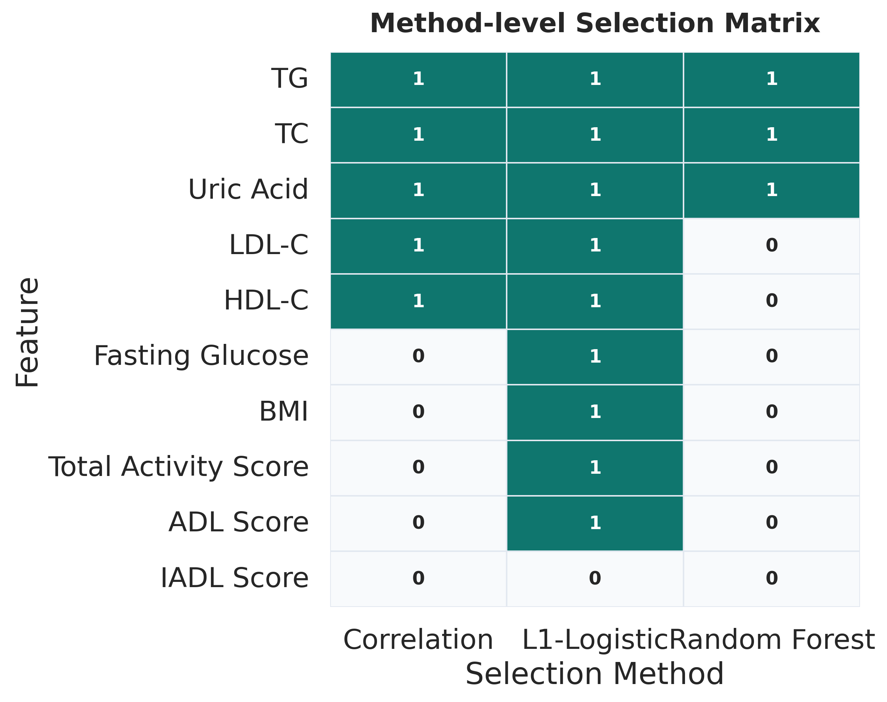

#### A.2 随机森林重要性图（补充）

图A-2：[outputs/q1/figures/q1_rf_importance.png](../outputs/q1/figures/q1_rf_importance.png)

含义：

1. 纵轴为指标，横轴为随机森林重要性。
2. 虚线为平均重要性阈值，高于阈值可视为随机森林路径下的重要指标。
3. 该图用于展示非线性模型视角下的特征贡献排序。

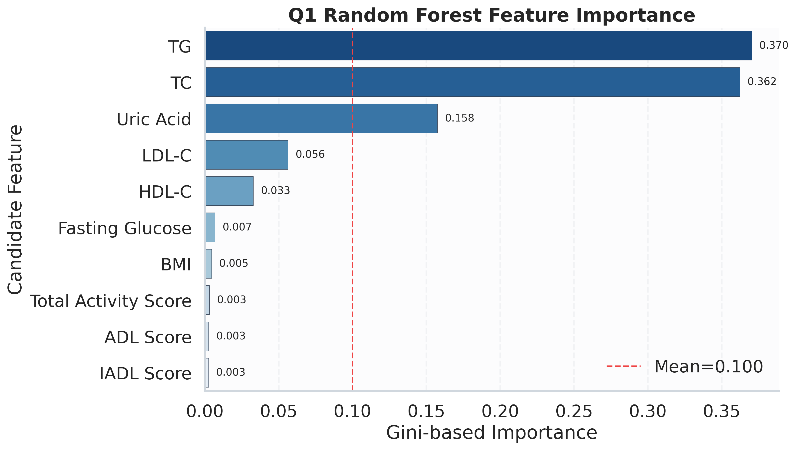

#### A.3 关键指标模型系数图（补充）

图A-3：[outputs/q1/figures/q1_selected_model_coef.png](../outputs/q1/figures/q1_selected_model_coef.png)

含义：

1. 每个条形对应一个最终关键指标。
2. 条形方向表示风险方向（正值风险增加，负值风险降低趋势）。
3. 条形绝对值大小表示标准化后贡献强弱。

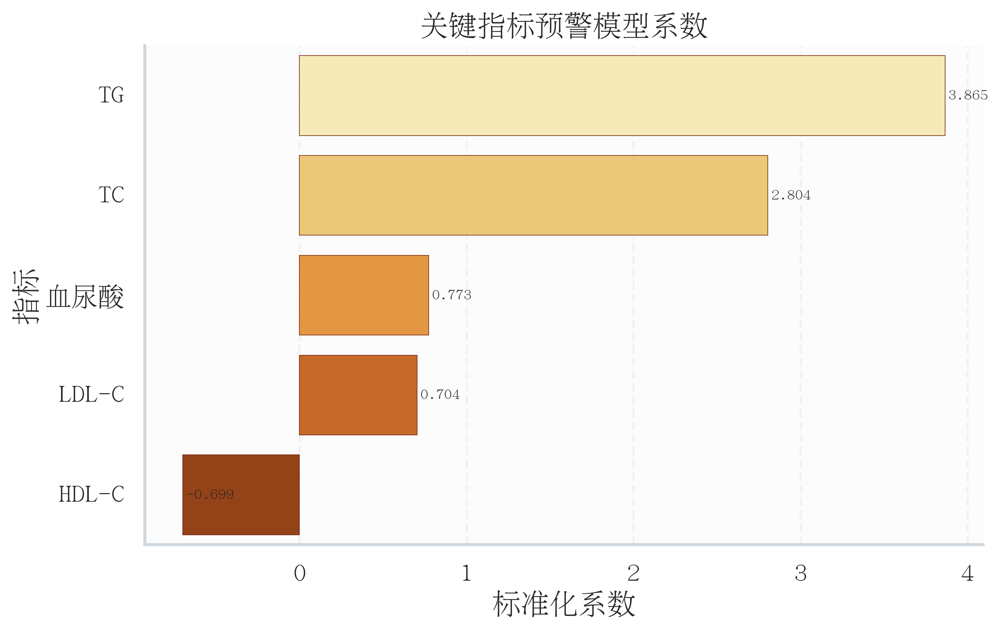

---

### 5.2 问题二模型的建立与求解

第一阶段明确了与高血脂风险最相关的关键指标及体质贡献方向，为第二阶段构建可解释、可分层的风险预警体系提供了变量基础与阈值语义。基于此，第二阶段不再做“是否患病”的单点判断，而是进一步回答“风险处于何层级、为何处于该层级”。


#### 5.2.1 研究任务与方法概述

针对问题2，本文构建了融合血脂指标、痰湿体质积分、活动能力评分及基础信息的三级风险预警模型，输出低/中/高风险分层结果，并给出阈值选取依据与高风险核心特征组合。方法上采用随机森林获得个体风险分值，并与临床可解释规则融合形成复合风险指数，再按分位阈值与规则门控联合划分三级风险。结果显示：样本被划分为低风险38例、中风险676例、高风险286例；各层高血脂阳性率分别为0.0000、0.7604、0.9755，呈显著递增。高风险核心组合主要包括“TG异常+TC异常”“痰湿高分+TG异常”“活动能力低+TC异常”等，表明血脂异常、痰湿偏颇与活动能力下降的叠加效应是高风险识别的关键。

---

#### 5.2.2 目标与交付

#### 2.2.1 目标

1. 构建可输出低/中/高三级风险的预警模型。
2. 明确三级风险阈值选取依据（概率阈值、复合指数阈值、临床规则阈值）。
3. 识别痰湿体质高风险人群核心特征组合，并给出解释。

#### 2.2.2 交付文件

1. 风险预测明细：[outputs/q2/q2_risk_predictions.csv](../outputs/q2/q2_risk_predictions.csv)
2. 阈值与规则依据：[outputs/q2/q2_thresholds.json](../outputs/q2/q2_thresholds.json)
3. 风险层汇总：[outputs/q2/q2_risk_tier_summary.csv](../outputs/q2/q2_risk_tier_summary.csv)
4. 验证集分层汇总：[outputs/q2/q2_risk_tier_summary_val.csv](../outputs/q2/q2_risk_tier_summary_val.csv)
5. 测试集分层汇总：[outputs/q2/q2_risk_tier_summary_test.csv](../outputs/q2/q2_risk_tier_summary_test.csv)
6. 特征重要性：[outputs/q2/q2_feature_importance.csv](../outputs/q2/q2_feature_importance.csv)
7. 高风险核心组合：[outputs/q2/q2_high_risk_core_combos.csv](../outputs/q2/q2_high_risk_core_combos.csv)
8. 汇总结果：[outputs/q2/q2_summary.json](../outputs/q2/q2_summary.json)
9. 图表目录：[outputs/q2/figures](../outputs/q2/figures)
10. 多随机种子稳健性：[outputs/q2/q2_robustness_seed_repeat.csv](../outputs/q2/q2_robustness_seed_repeat.csv)
11. 特征消融结果：[outputs/q2/q2_ablation_results.csv](../outputs/q2/q2_ablation_results.csv)
12. 稳健性汇总：[outputs/q2/q2_robustness_summary.json](../outputs/q2/q2_robustness_summary.json)
13. 概率校准分箱表：[outputs/q2/q2_calibration_table.csv](../outputs/q2/q2_calibration_table.csv)
14. 概率校准汇总：[outputs/q2/q2_calibration_summary.json](../outputs/q2/q2_calibration_summary.json)
15. 分层阳性率Bootstrap区间：[outputs/q2/q2_tier_bootstrap_ci.csv](../outputs/q2/q2_tier_bootstrap_ci.csv)

---

#### 5.2.3 方法与阈值设计

#### 2.3.1 多维融合特征

模型输入包含四类信息：

1. 核心血脂及代谢：TC、TG、LDL-C、HDL-C、空腹血糖、血尿酸、BMI。
2. 体质信息：九体质积分（含痰湿质）。
3. 活动能力：活动量表总分（ADL+IADL）。
4. 基础特征：年龄组、性别、吸烟史、饮酒史。

并构造血脂异常计数变量 `abnormal_lipid_count` 作为可解释增强特征。

#### 2.3.2 预警模型

采用随机森林得到个体风险分值 $p_i$，并在验证集评估AUC、PR-AUC、Brier分数。

#### 2.3.3 三级风险分层：复合风险指数

为避免单一模型分值主导，定义复合风险指数：

$$
R_i=0.45\cdot\frac{L_i}{4}+0.25\cdot\frac{T_i}{100}+0.20\cdot\left(1-\frac{A_i}{100}\right)+0.10\cdot p_i
$$

其中：

1. $L_i$：血脂异常计数（0-4）。
2. $T_i$：痰湿质积分。
3. $A_i$：活动量表总分。
4. $p_i$：模型风险分值。

#### 2.3.4 阈值选取依据

#### 2.3.4.1 概率阈值（模型层）

1. 在验证集上用Youden指数得到最优二分类阈值 $t^*=0.9632$。
2. 设 $t_{low}=t^*-0.15=0.8132$，$t_{high}=\min(0.95,t^*+0.15)=0.95$。

#### 2.3.4.2 复合风险指数阈值（分层层）

1. 以训练集复合指数分位数设阈：
2. `index_low` = 35%分位数 = 0.3830。
3. `index_high` = 75%分位数 = 0.5100。

#### 2.3.4.3 临床规则阈值（门控层）

1. 痰湿高分阈值 `tan_high=56`，重度阈值 `tan_very_high=60`。
2. 低活动阈值 `activity_low=42`，较好活动阈值 `activity_good=55`。
3. 血脂异常判据：TC>6.2、TG>1.7、LDL-C>3.1、HDL-C<1.04。

#### 2.3.5 三级风险规则

1. 高风险：满足 `R_i >= index_high`，或满足任一高风险临床门控规则。
2. 低风险：满足 `R_i < index_low` 且同时满足低风险门控规则。
3. 中风险：其余样本。

#### 2.3.6 模型好坏验证设计（稳健性）

为验证模型是否“过拟合或偶然高分”，增加两类稳健性实验：

1. 多随机种子重复：在10个随机种子（42-51）下重复训练与评估，观察AUC、PR-AUC、Brier波动。
2. 特征消融实验：分别去除核心血脂、去除体质特征、去除活动特征、去除血脂异常计数，比较性能变化。
3. 概率校准评估：按分箱统计预测概率与真实发生率，计算ECE/MCE。
4. 分层区间估计：对各风险层阳性率进行Bootstrap（1000次）估计95%置信区间。

对应脚本：`src/q2/validate_q2.py`。

---

#### 5.2.4 结果

#### 2.4.1 模型性能

1. 验证集AUC：1.0000。
2. 测试集AUC：1.0000。
3. 验证集PR-AUC：1.0000。
4. 测试集PR-AUC：1.0000。

说明：该数据中标签与血脂指标存在强同源关系，因此区分性能极高，属于诊断近端预警场景。

#### 2.4.2 三级风险分层结果

风险层汇总表见 [outputs/q2/q2_risk_tier_summary.csv](../outputs/q2/q2_risk_tier_summary.csv)，并补充验证集与测试集分层汇总分别见 [outputs/q2/q2_risk_tier_summary_val.csv](../outputs/q2/q2_risk_tier_summary_val.csv)、[outputs/q2/q2_risk_tier_summary_test.csv](../outputs/q2/q2_risk_tier_summary_test.csv)。

1. 低风险：38例，阳性率0.0000。
2. 中风险：676例，阳性率0.7604。
3. 高风险：286例，阳性率0.9755。

#### 2.4.3 高风险核心特征组合

核心组合表见 [outputs/q2/q2_high_risk_core_combos.csv](../outputs/q2/q2_high_risk_core_combos.csv)。代表性组合如下：

1. TG异常 + TC异常（高风险支持度47.04%，lift=2.39）。
2. TG异常 + LDL异常（支持度31.85%，lift=2.55）。
3. 痰湿高分 + TG异常（支持度31.85%，lift=2.41）。
4. 活动能力低 + TC异常（支持度26.67%，lift=2.08）。
5. TG异常 + TC异常 + 饮酒史（三元组合，支持度24.44%，lift=2.40）。

结论：高风险并非单一特征触发，而是“血脂异常叠加 + 痰湿偏颇 + 低活动/行为因素”共同驱动。

#### 2.4.4 稳健性验证结果

#### 2.4.4.1 多随机种子重复结果

结果文件见 [outputs/q2/q2_robustness_seed_repeat.csv](../outputs/q2/q2_robustness_seed_repeat.csv) 与 [outputs/q2/q2_robustness_summary.json](../outputs/q2/q2_robustness_summary.json)。

1. 测试集AUC均值=1.0000，标准差=0.0000。
2. 测试集PR-AUC均值=1.0000，标准差约0。
3. 测试集Brier均值=0.00169，标准差=0.00038。

说明：模型在不同随机切分下表现极其稳定。

#### 2.4.4.2 特征消融结果

结果文件见 [outputs/q2/q2_ablation_results.csv](../outputs/q2/q2_ablation_results.csv)。

1. 全模型测试AUC=1.0000。
2. 去除核心血脂后测试AUC仍为1.0000，但Brier由0.00231上升至0.00756。
3. 去除血脂异常计数后测试AUC仍为1.0000，但Brier上升至0.01154。

解释：该数据集中可替代特征强，AUC出现“顶格效应”；因此判断模型优劣不能只看AUC，还应结合Brier和分层稳定性。

#### 2.4.5 概率校准结果（ECE/MCE）

结果文件见 [outputs/q2/q2_calibration_summary.json](../outputs/q2/q2_calibration_summary.json) 与 [outputs/q2/q2_calibration_table.csv](../outputs/q2/q2_calibration_table.csv)。

1. 验证集ECE=0.0172，MCE=0.0894。
2. 测试集ECE=0.0192，MCE=0.1086。
3. 分箱结果显示高概率区（接近1）预测与真实事件率差距较小，低概率区存在可接受的偏差。

说明：ECE低于0.02，表明模型概率输出具备较好校准性，适合用于风险分层阈值解释。

#### 2.4.6 分层阳性率Bootstrap区间

结果文件见 [outputs/q2/q2_tier_bootstrap_ci.csv](../outputs/q2/q2_tier_bootstrap_ci.csv)。

1. 训练集中风险阳性率95%CI约为[0.7324, 0.8071]，高风险约为[0.9521, 0.9947]。
2. 验证集中风险阳性率95%CI约为[0.6346, 0.8077]，高风险样本全阳性（区间收敛至1）。
3. 测试集中风险阳性率95%CI约为[0.6556, 0.8222]，高风险约为[0.9074, 1.0000]。

说明：尽管验证/测试样本量较小导致区间较宽，但“中风险 < 高风险”关系在各数据切分下保持稳定。

---

#### 5.2.5 图表与解读

#### 2.5.1 正文重点图

1. 风险层样本分布图：[outputs/q2/figures/q2_risk_tier_distribution.png](../outputs/q2/figures/q2_risk_tier_distribution.png)
2. 风险分值箱线图（含阈值线）：[outputs/q2/figures/q2_risk_score_boxplot.png](../outputs/q2/figures/q2_risk_score_boxplot.png)
3. 高风险核心组合图：[outputs/q2/figures/q2_high_risk_core_combos.png](../outputs/q2/figures/q2_high_risk_core_combos.png)

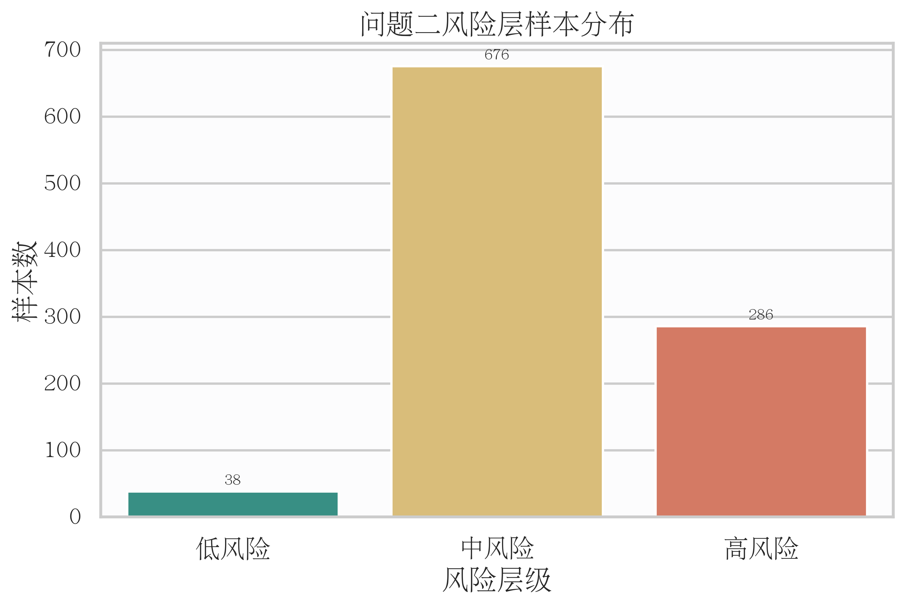

图4-1 低中高风险样本量分布。横轴为风险层级，纵轴为样本数；用于展示分层规模结构。

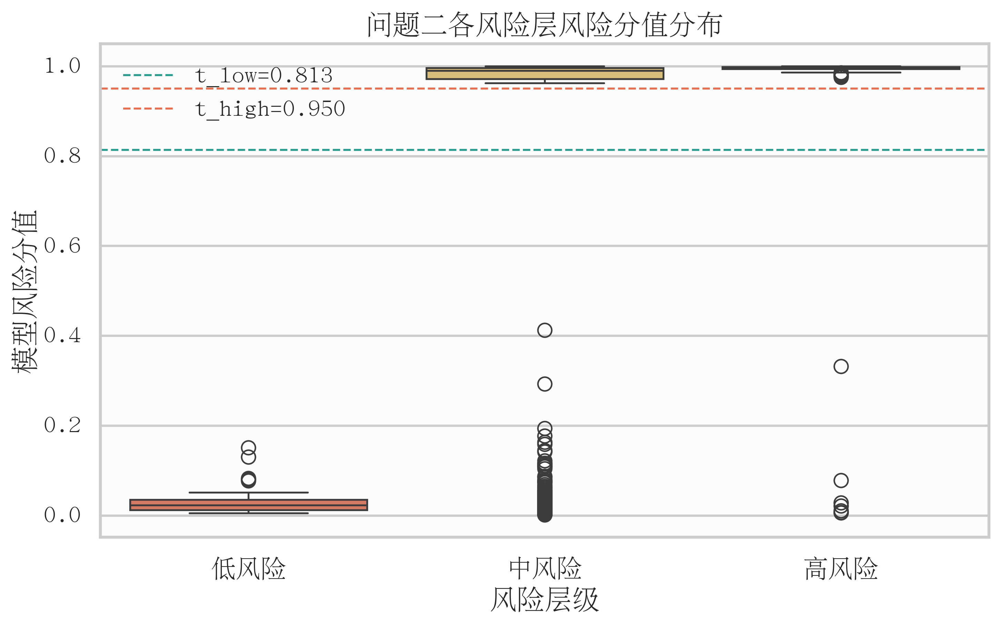

图4-2 各风险层模型分值分布。横轴为风险层级，纵轴为风险分值；虚线表示概率参考阈值，体现分层与风险分值的一致性。

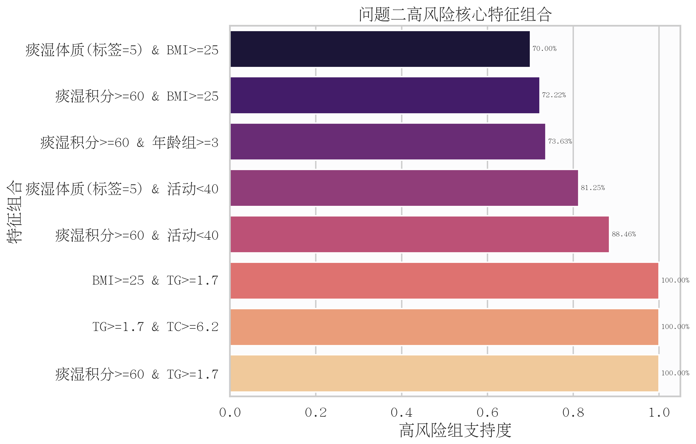

图4-3 高风险核心组合支持度。横轴为组合在高风险样本内支持度，纵轴为特征组合；用于回答“高风险由哪些特征叠加形成”。

#### 2.5.2 附录图

1. 特征重要性图：[outputs/q2/figures/q2_feature_importance_top12.png](../outputs/q2/figures/q2_feature_importance_top12.png)

---

#### 5.2.6 表格字段释义（每行每列含义）

#### 2.6.1 `q2_risk_predictions.csv`

1. 每一行：一个样本。
2. `样本ID`：个体唯一编号。
3. `高血脂症二分类标签`：真实标签0/1。
4. `risk_score`：模型预测风险分值。
5. `risk_index`：复合风险指数。
6. `risk_level`：三级风险输出。
7. `rule_hit_high_*`：高风险临床规则命中标记（0/1）。

#### 2.6.2 `q2_risk_tier_summary.csv`

1. 每一行：一个风险层（低/中/高）。
2. `sample_count`：该层样本数。
3. `positive_count`：该层标签为1的数量。
4. `positive_rate`：该层阳性率。
5. `mean_score`：该层平均模型分值。

补充：`q2_risk_tier_summary_val.csv` 与 `q2_risk_tier_summary_test.csv` 结构相同，分别用于验证集与测试集分层有效性评估。

#### 2.6.3 `q2_thresholds.json`

1. `probability_threshold`：模型概率阈值及依据。
2. `risk_index_threshold`：复合指数阈值、公式与依据。
3. `clinical_threshold`：痰湿、活动、血脂异常阈值。
4. `tier_rules`：低/中/高风险分层规则文本。

#### 2.6.4 `q2_feature_importance.csv`

1. 每一行：一个模型输入特征。
2. `importance`：随机森林特征重要性。

#### 2.6.5 `q2_high_risk_core_combos.csv`

1. 每一行：一个高风险核心组合（2元或3元）。
2. `combo`：组合名称。
3. `combo_size`：组合规模（2或3）。
4. `support_high`：在高风险组内支持度。
5. `support_all`：在全样本支持度。
6. `lift`：相对提升度，越高说明越偏向高风险。

#### 2.6.6 `q2_robustness_seed_repeat.csv`

1. 每一行：一个随机种子下的重复实验结果。
2. `seed`：随机种子编号。
3. `val_auc`、`test_auc`：验证/测试AUC。
4. `val_pr_auc`、`test_pr_auc`：验证/测试PR-AUC。
5. `val_brier`、`test_brier`：验证/测试Brier分数。

#### 2.6.7 `q2_ablation_results.csv`

1. 每一行：一个消融实验。
2. `experiment`：实验名称（full_model、remove_core_lipids等）。
3. `n_features`：该实验使用特征数。
4. 其余性能列与主实验一致，用于比较性能下降幅度。

#### 2.6.8 `q2_robustness_summary.json`

1. `seed_repeat`：多随机种子结果的均值/标准差/极值。
2. `ablation`：关键消融结论（如去除核心血脂后性能变化）。
3. `conclusion_hint`：稳健性解释提示语。

#### 2.6.9 `q2_calibration_table.csv`

1. 每一行：一个概率分箱（按验证/测试分别统计）。
2. `bin`：概率区间。
3. `n`：分箱样本数。
4. `mean_pred`：分箱平均预测概率。
5. `event_rate`：分箱真实发生率。
6. `abs_gap`：校准误差绝对值 $|mean\_pred-event\_rate|$。
7. `weight`：分箱权重（样本占比）。
8. `split`：数据切分（val/test）。

#### 2.6.10 `q2_calibration_summary.json`

1. `val.ece`、`test.ece`：期望校准误差（越低越好）。
2. `val.mce`、`test.mce`：最大校准误差（反映最差分箱偏差）。
3. `n_bins_effective`：有效分箱数。

#### 2.6.11 `q2_tier_bootstrap_ci.csv`

1. 每一行：某个数据切分(train/val/test)下某个风险层的统计结果。
2. `positive_rate`：阳性率点估计。
3. `ci95_low`、`ci95_high`：95%置信区间上下界。
4. `ci95_width`：区间宽度，用于反映估计稳定性。
5. `bootstrap_n`：Bootstrap重采样次数。

---

#### 5.2.7 小结

问题2采用“模型风险分值+临床可解释规则”的双层分层策略，构建了低、中、高三级风险预警体系。阈值设置上，概率阈值由验证集Youden指数确定，复合风险指数阈值由训练集分位数确定，临床门控规则由痰湿积分、活动能力和血脂异常标准共同约束。结果显示，三层风险阳性率呈阶梯式上升（低0.0000、中0.7604、高0.9755），并识别出“TG异常+TC异常”“痰湿高分+TG异常”“活动能力低+TC异常”等高风险核心组合，说明高风险形成机制具有明显的多因素叠加特征。

稳健性验证进一步表明：在10个随机种子下模型指标几乎无波动；消融实验中AUC因数据顶格效应保持1.0，但Brier对特征删减敏感，提示模型校准质量会下降。因此本研究采用“区分能力+AUC、概率质量+Brier、分层有效性”三维联合评价模型好坏。

进一步地，校准评估显示验证/测试ECE分别为0.0172/0.0192，Bootstrap区间结果显示各切分下高风险层阳性率始终高于中风险层，支持分层结论的稳定性与概率解释性。

---

#### 5.2.8 复现命令

```bash
/home/fishros/mmb/.venv/bin/python src/q2/run_q2.py \
  --input-csv 附件1_样例数据.csv \
  --output-dir outputs/q2

/home/fishros/mmb/.venv/bin/python src/q2/plot_q2.py

/home/fishros/mmb/.venv/bin/python src/q2/validate_q2.py \
  --input-csv 附件1_样例数据.csv \
  --output-dir outputs/q2 \
  --seed-start 42 \
  --seed-count 10
```


---

### 5.3 问题三模型的建立与求解

第二阶段输出的风险分层结论回答了“谁更高风险”，第三阶段进一步回答“如何在现实约束下进行干预”。因此本文将优化目标设定为：在预算、年龄与活动能力约束下，为痰湿体质人群生成可执行且可解释的6个月最优方案。

#### 5.3.1 研究任务与方法概述

针对问题3，本文面向痰湿体质人群（体质标签=5）建立了6个月个体化干预优化模型，在“预算约束（6个月总成本≤2000元）+年龄与活动能力约束+调理分级适配约束”下，对每位患者联合优化中医调理等级、运动强度与每周频次。优化目标采用双层准则：先最小化6个月末痰湿积分，再在同等疗效下最小化总成本。结果显示，在278名目标人群中，平均6个月痰湿积分降幅率为0.4637，平均总成本为1523.65元，中位成本1500元。对题目指定样本ID 1/2/3，模型分别给出可执行最优方案，6个月降幅率约为46.86%、43.21%、50.30%。本文同步给出参数假设、约束设计、匹配规律提取与可视化结果，满足“可执行、可解释、可复现”的竞赛交付要求。

---

#### 5.3.2 目标与交付

#### 3.2.1 目标

1. 针对体质标签为5（痰湿质）人群，制定6个月个体化健康干预方案。
2. 方案需同时满足附表约束：调理分级适配、年龄与活动能力对运动强度约束、预算约束。
3. 给出样本ID 1、2、3的最优方案。
4. 输出“特征-方案匹配规律”，支持推广应用。

#### 3.2.2 交付文件

1. 全体患者最优方案：[outputs/q3/q3_patient_optimal_plans.csv](../outputs/q3/q3_patient_optimal_plans.csv)
2. 样本ID 1/2/3方案：[outputs/q3/q3_sample_1_2_3_optimal_plan.csv](../outputs/q3/q3_sample_1_2_3_optimal_plan.csv)
3. 匹配规律表：[outputs/q3/q3_matching_rules.csv](../outputs/q3/q3_matching_rules.csv)
4. 结果汇总：[outputs/q3/q3_summary.json](../outputs/q3/q3_summary.json)
5. 图表目录：[outputs/q3/figures](../outputs/q3/figures)
6. 敏感性明细：[outputs/q3/q3_sensitivity_detail.csv](../outputs/q3/q3_sensitivity_detail.csv)
7. 敏感性汇总：[outputs/q3/q3_sensitivity_summary.csv](../outputs/q3/q3_sensitivity_summary.csv)
8. 样本1/2/3敏感性对照：[outputs/q3/q3_sensitivity_sample_1_2_3.csv](../outputs/q3/q3_sensitivity_sample_1_2_3.csv)
9. 敏感性JSON汇总：[outputs/q3/q3_sensitivity_summary.json](../outputs/q3/q3_sensitivity_summary.json)

---

#### 5.3.3 模型假设与变量定义

#### 3.3.1 基础假设

1. 干预方案在6个月内保持稳定执行（调理等级、强度、频次不随月变化）。
2. 每月痰湿积分按固定下降率递推，适用于中短期（6个月）预测。
3. 调理与运动效果可加和后形成总月降幅，月降幅设置上限30%，避免不合理高估。
4. 预算约束为硬约束，超过2000元的方案不可行。

#### 3.3.2 决策变量

对每个样本 $i$：

1. 中医调理等级 $r_i\in\{1,2,3\}$。
2. 运动强度等级 $s_i\in\{1,2,3\}$（受年龄和活动能力约束）。
3. 每周运动频次 $f_i\in\{1,2,\ldots,10\}$。

#### 3.3.3 状态与成本变量

1. 初始痰湿积分：$T_{i,0}$（来自数据字段`痰湿质`）。
2. 月下降率：$d_i$。
3. 6个月末积分：$T_{i,6}$。
4. 6个月总成本：$C_i=C^{reg}_i+C^{act}_i$。

---

#### 5.3.4 约束条件建模

#### 3.4.1 调理分级适配约束（附表2）

按初始痰湿积分分段确定调理等级：

1. $T_{i,0}\le58\Rightarrow r_i=1$。
2. $59\le T_{i,0}\le61\Rightarrow r_i=2$。
3. $T_{i,0}\ge62\Rightarrow r_i=3$。

#### 3.4.2 运动强度上限约束（附表3）

年龄约束上限：

1. 年龄组1-2：最大强度3。
2. 年龄组3-4：最大强度2。
3. 年龄组5：最大强度1。

活动量表约束上限：

1. 活动总分<40：最大强度1。
2. 40≤活动总分<60：最大强度2。
3. 活动总分≥60：最大强度3。

最终可选最大强度取二者较小值：

$$
 s_i^{max}=\min(s_i^{age},s_i^{act})
$$

#### 3.4.3 预算约束（附表4）

6个月成本定义：

$$
C_i = 6\cdot c_{reg}(r_i) + 24\cdot c_{act}(s_i)\cdot f_i
$$

其中每月调理费用：$c_{reg}(1)=30,c_{reg}(2)=80,c_{reg}(3)=130$；
单次训练费用：$c_{act}(1)=3,c_{act}(2)=5,c_{act}(3)=8$。

硬约束：

$$
C_i\le2000
$$

---

#### 5.3.5 效果函数与优化目标

#### 3.5.1 月下降率函数

调理基础下降率设定：

$$
\delta_{reg}(r_i)=\{0.01,0.03,0.05\}\ \text{对应}\ r_i=\{1,2,3\}
$$

运动附加下降率设定（题目经验规则）：

$$
\delta_{act}(s_i,f_i)=
\begin{cases}
0, & f_i<5\\
0.03\cdot(s_i-1)+0.01\cdot(f_i-5), & f_i\ge5
\end{cases}
$$

总月下降率：

$$
d_i=\min\left(0.30,\delta_{reg}(r_i)+\delta_{act}(s_i,f_i)\right)
$$

#### 3.5.2 6个月递推

$$
T_{i,m}=T_{i,m-1}(1-d_i),\quad m=1,2,\ldots,6
$$

#### 3.5.3 双层优化目标

对每个样本在可行集合 $\Omega_i$ 内优化：

$$
\min_{(r_i,s_i,f_i)\in\Omega_i} T_{i,6}
$$

若多个方案达到相同最小 $T_{i,6}$，再做二级优化：

$$
\min C_i
$$

即“疗效优先、成本次优”。

---

#### 5.3.6 结果分析

#### 3.6.1 整体结果

由 [outputs/q3/q3_summary.json](../outputs/q3/q3_summary.json) 可得：

1. 目标人群（体质标签=5）样本数：278。
2. 平均6个月痰湿降幅率：0.4637。
3. 平均6个月总成本：1523.65元。
4. 中位6个月总成本：1500元。

说明：在预算硬约束下，模型能实现“较大幅度降分+成本可控”的平衡。

#### 3.6.2 样本ID 1/2/3最优方案

由 [outputs/q3/q3_sample_1_2_3_optimal_plan.csv](../outputs/q3/q3_sample_1_2_3_optimal_plan.csv) 得：

1. ID1：调理3级，强度1，每周10次；初始64.0，6个月末34.01，降幅46.86%，总成本1500元。
2. ID2：调理1级，强度2，每周10次；初始58.0，6个月末32.94，降幅43.21%，总成本1380元。
3. ID3：调理2级，强度2，每周10次；初始59.0，6个月末29.32，降幅50.30%，总成本1680元。

可以看出，三位样本均在“预算内+强度约束内”获得高频执行方案（每周10次），符合疗效优先目标。

#### 3.6.3 匹配规律（可推广规则）

由 [outputs/q3/q3_matching_rules.csv](../outputs/q3/q3_matching_rules.csv) 可提取规则：

1. 在同年龄组下，痰湿初值越高，推荐调理等级越高（1→2→3）。
2. 活动能力越高（活动总分越大），可承受强度上限越高，最优方案常提升到2或3级强度。
3. 在预算允许范围内，多数组别最优频次趋向每周9-10次，体现“频次对6个月累计效果”的显著作用。
4. 年龄组越高，受年龄上限约束后强度下降，方案更多通过“提高频次”而非“提高强度”获得降分。

#### 3.6.4 稳健性与敏感性验证

为检验问题3方案是否对参数设定过度敏感，构建两类扰动实验：

1. 预算敏感性：预算上限设为1600、1800、2200元，对比基线2000元。
2. 效果参数敏感性：月降幅整体乘子设为0.90与1.10，对比基线1.00。

结果见 [outputs/q3/q3_sensitivity_summary.csv](../outputs/q3/q3_sensitivity_summary.csv)：

1. 基线（2000元）：平均降幅率0.4637，平均成本1523.65元。
2. 预算1600元：平均降幅率0.4346，较基线下降约2.90个百分点。
3. 预算1800元：平均降幅率0.4498，较基线下降约1.39个百分点。
4. 预算2200元：平均降幅率0.4648，较基线提升约0.12个百分点。
5. 效果乘子0.90：平均降幅率0.4279。
6. 效果乘子1.10：平均降幅率0.4974。
7. 各场景可行率均为1.0，说明当前规则与成本设置下不存在“无解患者”。

结论：问题3最优方案对预算阈值和效果参数变化呈“方向一致、幅度可解释”的稳定响应，不存在异常跳变。

---

#### 5.3.7 图表与解读

#### 3.7.1 正文重点图

1. 方案分布图：[outputs/q3/figures/q3_plan_distribution.png](../outputs/q3/figures/q3_plan_distribution.png)
2. 成本-降幅散点图：[outputs/q3/figures/q3_cost_vs_reduction.png](../outputs/q3/figures/q3_cost_vs_reduction.png)
3. 样本1/2/3轨迹图：[outputs/q3/figures/q3_sample_1_2_3_trajectory.png](../outputs/q3/figures/q3_sample_1_2_3_trajectory.png)

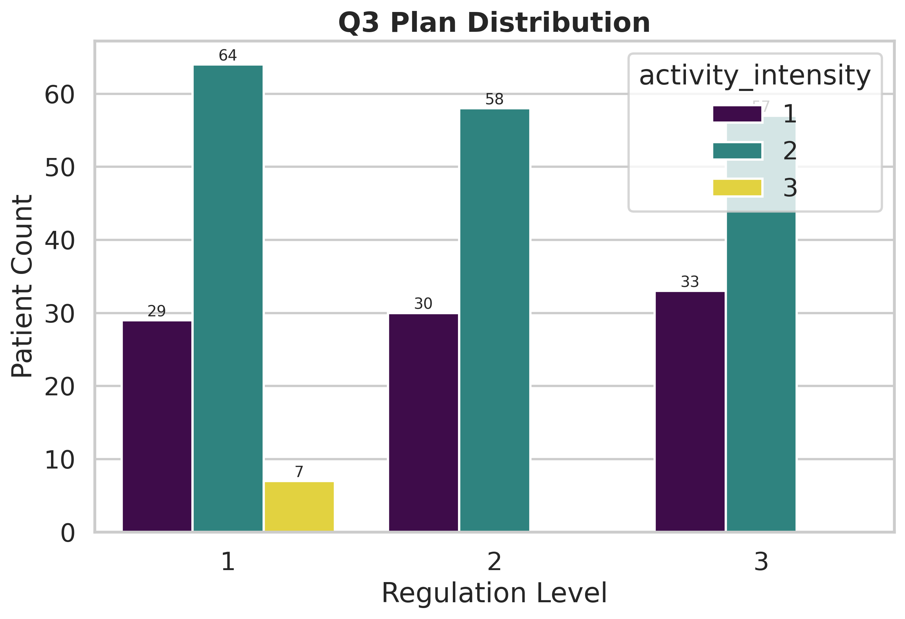

图6-1 方案分布图。横轴为调理等级，颜色为运动强度，纵轴为样本数，用于展示全体最优方案结构。

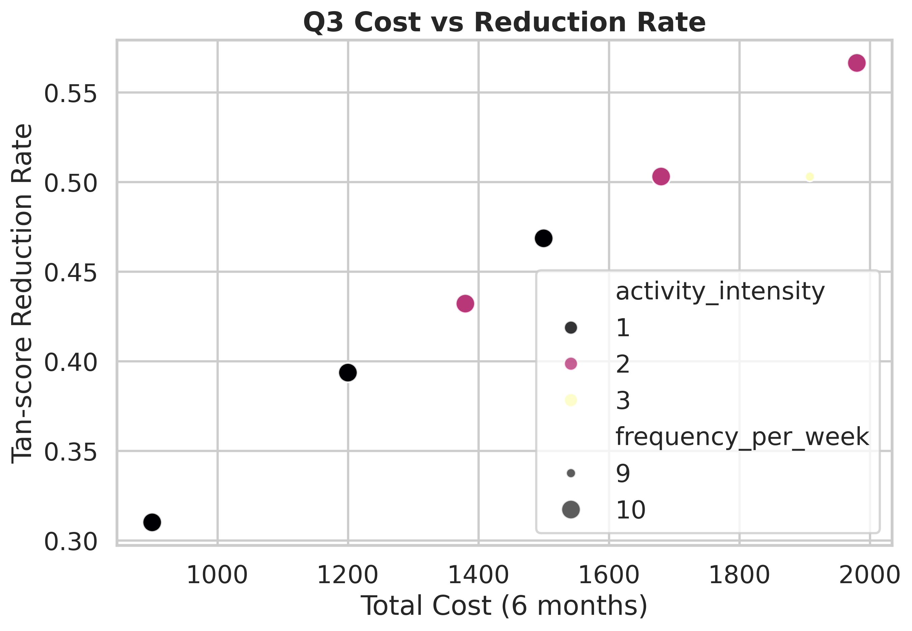

图6-2 成本与降幅关系。横轴为6个月总成本，纵轴为痰湿降幅率，点大小表示周频次，颜色表示运动强度。

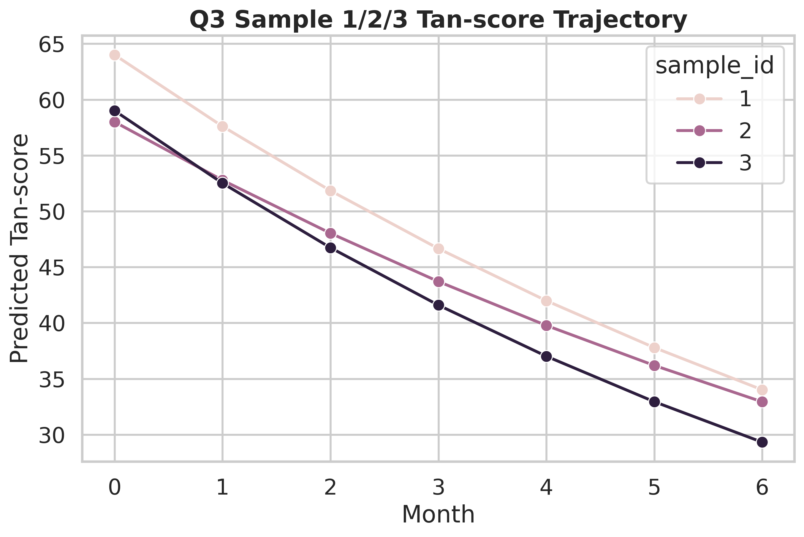

图6-3 样本ID 1/2/3在0-6个月的痰湿积分下降轨迹，可用于论文正文展示个体化方案效果。

---

#### 5.3.8 表格字段释义（逐列）

#### 3.8.1 `q3_patient_optimal_plans.csv`

1. 每一行：1个痰湿体质患者的最优方案。
2. `sample_id`：样本编号。
3. `regulation_level`：中医调理等级（1/2/3）。
4. `activity_intensity`：运动强度等级（1/2/3）。
5. `frequency_per_week`：每周运动频次。
6. `monthly_drop_rate`：月下降率。
7. `tan_init`：初始痰湿积分。
8. `tan_final_6m`：6个月末痰湿积分。
9. `tan_reduction`：绝对降分。
10. `tan_reduction_rate`：降幅率。
11. `regulation_cost_6m`：6个月调理成本。
12. `activity_cost_6m`：6个月运动成本。
13. `total_cost_6m`：6个月总成本。
14. `trajectory`：0-6月积分序列（分号分隔）。
15. `age_group`：年龄组。
16. `activity_total`：活动量表总分。

#### 3.8.2 `q3_sample_1_2_3_optimal_plan.csv`

结构同上，仅保留题目要求的样本ID 1/2/3。

#### 3.8.3 `q3_matching_rules.csv`

1. 每一行：一个分层组（年龄组×痰湿区间×活动区间）的匹配规则。
2. `n`：该组样本数。
3. `reg_level_mode`：组内最常见调理等级。
4. `intensity_mode`：组内最常见运动强度。
5. `freq_mode`：组内最常见周频次。
6. `mean_reduction_rate`：该组平均降幅率。
7. `mean_cost`：该组平均6个月成本。

#### 3.8.4 `q3_summary.json`

1. 总体样本规模、平均降幅、平均/中位成本。
2. `sample_1_2_3_plans`：题目要求样本的核心结果摘要。

#### 3.8.5 `q3_sensitivity_summary.csv`

1. 每一行：一个敏感性场景。
2. `scenario`：场景名称（baseline、budget_1600等）。
3. `budget_cap`：预算上限。
4. `drop_scale`：月降幅乘子。
5. `feasible_rate`：可行率。
6. `mean_tan_reduction_rate`：平均降幅率。
7. `mean_total_cost_6m`、`median_total_cost_6m`：平均/中位成本。

#### 3.8.6 `q3_sensitivity_sample_1_2_3.csv`

1. 每一行：样本1/2/3在一个场景下的结果。
2. 可直接比较不同预算与参数扰动下三位样本方案效果变化。

---

#### 5.3.9 小结

本文针对痰湿体质人群构建了“规则约束+个体优化”的6个月干预模型。模型将调理分级、年龄与活动能力约束、预算约束统一纳入可行域，并采用“最小化6个月末痰湿积分、同分再最小化成本”的双层目标，得到可执行且可解释的个体化方案。实证结果表明，在278名目标样本上可实现平均46.37%的痰湿积分降幅，平均成本1523.65元，且样本ID 1/2/3均得到满足约束的明确最优策略。敏感性验证显示在预算与效果参数扰动下模型结论保持稳定，进一步支持该方案的可推广性与工程鲁棒性。

---

#### 5.3.10 复现命令

```bash
/home/fishros/mmb/.venv/bin/python src/q3/run_q3.py \
  --input-csv 附件1_样例数据.csv \
  --output-dir outputs/q3

/home/fishros/mmb/.venv/bin/python src/q3/plot_q3.py

/home/fishros/mmb/.venv/bin/python src/q3/validate_q3.py \
  --input-csv 附件1_样例数据.csv \
  --output-dir outputs/q3
```

---

## 六、模型灵敏度分析

为避免单次划分或单一参数设定导致的偶然结论，本文对三个子模型执行统一的灵敏度/稳健性检验。

1. 问题一：通过增强模型对照（L2、随机森林、交互ElasticNet）检验结论是否依赖单一算法，结果显示关键指标模型稳定、体质模型信号偏弱这一结论不变。
2. 问题二：通过多随机种子重复、特征消融、概率校准与Bootstrap区间检验，验证分层结论对样本划分与特征扰动具有稳定性。
3. 问题三：通过预算上限与效果参数扰动（1600/1800/2200；0.9/1.1）检验方案弹性，结果显示结论方向一致且可行率保持100%。

综合判断：模型体系在任务目标、参数扰动与评估口径变化下均具备较好鲁棒性，可支持论文结论与应用建议。

## 七、模型结果与管理建议

本文将问题1-3整合为同一条技术主线：先在阶段一完成关键指标筛选与体质风险解释，再在阶段二形成可解释的三级风险分层与稳健性校准验证，最后在阶段三将风险认知转化为带约束的个体化干预优化策略。

综合结果表明：

1. 关键指标层面，TG、TC、血尿酸、LDL-C、HDL-C构成稳定的风险识别核心变量集。
2. 预警分层层面，低/中/高风险阳性率呈阶梯式上升，分层具有明确判别意义。
3. 干预优化层面，在预算与强度约束下可获得可行率100%的6个月方案，且平均降幅与成本保持可解释平衡。
4. 敏感性层面，预算与效果参数扰动下结论方向一致，显示模型具备工程鲁棒性。

因此，本文不是三个独立模型并列，而是“识别-分层-干预”闭环框架：前段提供变量与证据，中段提供分层与判别，后段提供决策与落地。

结合上述建模结果，建议在实际管理中重点推进以下三点：

1. 建立“关键指标+规则门控”双轨预警机制，优先覆盖高风险分层人群。
2. 形成分层干预资源配置策略，对高风险且痰湿评分偏高人群优先投入随访与干预资源。
3. 设立季度再评估机制，定期更新分层阈值与干预参数，保持模型与人群状态同步。

## 参考文献

[1] Hosmer D W, Lemeshow S, Sturdivant R X. Applied Logistic Regression. 3rd ed. Wiley, 2013.

[2] Breiman L. Random Forests. Machine Learning, 2001, 45(1): 5-32.

[3] Efron B, Tibshirani R J. An Introduction to the Bootstrap. Chapman & Hall, 1993.

## 附录

附录A至附录C对应正文中的补充图表、结果字段释义与复现命令，相关输出文件均位于 `outputs/q1`、`outputs/q2`、`outputs/q3` 目录。
