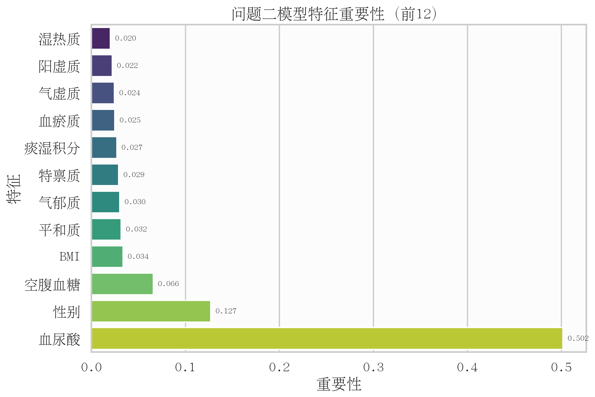

# 中老年人群高血脂症风险预警及干预方案优化（最终版）

## 摘要

本文围绕中老年人群高血脂风险识别与干预优化问题，构建“特征识别与机理解释—风险分层预警—个体化干预优化”的一体化建模框架。首先，基于相关性筛选、L1-Logistic与随机森林投票机制识别关键风险指标，并通过九体质Logistic模型解释体质贡献方向；其次，采用“网文式双轨”重算问题二：轨道A使用去血脂特征评估真实预警能力，轨道B加入血脂特征作为诊断上限对照，并用题目给定规则直接完成三级分层；最后，在预算、年龄与活动能力约束下建立6个月干预优化模型，输出个体最优策略与可推广匹配规律。全文每一问均按“输入变量→建模处理→判定规则→结果输出→稳健性验证”的同一逻辑链展开，保证结论来源可追溯。结果表明，风险分层具有清晰区分度，干预方案在现实约束下具备可行性与稳定性。问题二中，轨道A（去血脂）5-fold AUC=0.8771±0.0251，轨道B（含血脂）5-fold AUC=0.9928±0.0096；按题目规则分层后，低/中/高风险分别为142/748/110例，对应阳性率0.0000/0.9131/1.0000。问题三中，278名痰湿体质样本在预算约束下可行率为100%，平均6个月降幅率为0.4637。需要强调的是，本文模型更适用于“已病识别与分层管理”，不宜直接外推为“未病早筛”。本文实现了从风险认知到策略生成的闭环，为慢病管理提供量化依据。

关键词：高血脂预警；中医体质；风险分层；个体化干预；稳健性验证

---

## 目录

1. 一、问题重述与背景
2. 二、问题分析
3. 三、模型假设与符号约定
4. 四、符号说明
5. 五、模型的建立与求解
6. 六、模型灵敏度分析
7. 七、模型结果、创新与政策建议
8. 八、参考文献
9. 九、附录

---

## 一、问题重述与背景


### 1.1 问题背景与研究任务

针对 MathorCup C 题，本文围绕问题1完成了从数据预处理、关键指标筛选到九种体质风险贡献度评估的完整实现流程。基于1000例样本，采用分层抽样构建训练集/验证集/测试集（700/150/150），并在训练集上执行相关性筛选、L1-Logistic稀疏筛选和随机森林重要性评估，采用投票法（至少两法入选）得到5个关键指标：TG、TC、血尿酸、LDL-C、HDL-C。随后基于九体质构建Logistic回归并输出OR及95%置信区间。结果显示，九体质模型在验证集AUC为0.4313，Hosmer-Lemeshow检验p=0.8322；关键指标预警模型验证集AUC为0.9864。本文同时给出问题1的可复现实验流程、核心公式、可视化图表与结果解读。

### 1.2 需要解决的问题

高血脂症是中老年人心脑血管事件的重要危险因素。传统风险评估常依赖血脂检测结果，缺少中医体质与活动能力等信息融合。题目要求从血常规与活动量表中筛选关键指标，既要表征痰湿体质严重程度，也要具备发病风险预警能力，并量化九种体质对发病风险的贡献差异。

---

### 1.3 数据基础与任务拆解

#### 1.3.1 问题1目标

1. 从候选指标（TC、TG、LDL-C、HDL-C、空腹血糖、血尿酸、BMI、ADL总分、IADL总分、活动总分）中筛选关键指标。
2. 建立九体质风险贡献度模型，输出OR值、95%CI及显著性检验结果。

#### 1.3.2 数据与变量

1. 样本量：1000。
2. 标签：高血脂症二分类标签（0/1）。
3. 体质变量：平和质、气虚质、阳虚质、阴虚质、痰湿质、湿热质、血瘀质、气郁质、特禀质。
4. 目标输出：关键指标清单 + 九体质OR贡献表。

#### 1.3.3 任务拆解与交付口径

为保证正文叙事紧凑，本节“给论文手”的交付说明、结果文件映射与复现清单统一后置至文末“附录D 论文手说明与复现清单”。

---

## 二、问题分析

基于赛题目标，本文将研究任务拆分为三个递进子问题，并形成“识别—分层—干预”的闭环分析逻辑：

1. 问题一聚焦关键指标识别与机理解释，回答“哪些变量与风险最相关、方向如何”。
2. 问题二聚焦风险分层预警，回答“样本处于何种风险层级、分层依据是什么”。
3. 问题三聚焦约束下干预优化，回答“在预算与执行约束下如何生成可落地方案”。

该分析路径与范文中的“预测—评估—优化”结构一致，均遵循“先认识系统，再量化风险，最后输出策略”的工程化建模流程。

### 2.1 数据分析

本题数据为典型“结构化健康指标 + 标签”样本，包含血脂、生化、体质、活动能力及基础信息，适合构建分阶段模型链路。

1. 数据用途：用于关键指标筛选、风险分层建模、个体化干预优化与敏感性检验。
2. 分析方法：描述统计与相关分析用于识别候选变量，监督学习用于风险评分，规则门控用于风险分层，约束优化用于方案生成。
3. 分析理由：该数据同时覆盖风险形成因素与干预可执行约束，能够支撑“识别-分层-干预”全流程建模。

### 2.2 问题一分析

问题一是后续建模的起点，目标是形成“可解释且可预警”的变量基础。其关键在于区分两类任务：

1. 解释任务：刻画九体质变量与风险方向关系，强调统计解释性。
2. 预测任务：筛选高判别力指标，强调风险识别性能。

因此本文采用“双模型分工”策略，避免将解释性与预测性混为同一目标。

### 2.3 问题二分析

问题二是将单点预测扩展为分层预警，核心是把“概率分值”转化为“可执行层级”。

1. 通过复合风险指数融合血脂异常、痰湿评分、活动能力与模型分值，提升分层可解释性。
2. 通过临床规则门控约束高风险判定，避免纯算法阈值造成的分层偏移。
3. 通过多随机种子、消融、校准与Bootstrap验证稳定性，确保分层结论可复核。

### 2.4 问题三分析

问题三是模型落地环节，核心是把风险认知转化为现实约束下的干预决策。

1. 在预算、年龄、活动能力约束下优化调理等级、运动强度和频次。
2. 采用“先最小化6个月末痰湿积分，再最小化成本”的双层目标，保证疗效优先。
3. 通过预算与效果参数扰动检验方案稳健性，避免只在单一参数下最优。

## 三、模型假设与符号约定

1. 样本记录独立同分布，测量误差对总体规律影响可忽略。
2. 训练/验证/测试分布一致，分层抽样可保持标签比例稳定。
3. OR解释基于其他变量保持不变条件下的边际变化。
4. 关键指标筛选过程仅在训练集进行，避免数据泄漏。
5. 诊断标签与血脂指标可能存在同源关系，需在讨论中解释其对AUC的影响。

---

## 四、符号说明

| 符号 | 含义 |
| --- | --- |
| $Y$ | 高血脂二分类标签 |
| $X_j$ | 第 $j$ 个候选特征 |
| $T$ | 痰湿质积分 |
| $p_i$ | 第 $i$ 个样本模型风险分值 |
| $R_i$ | 第 $i$ 个样本复合风险指数 |
| $r_i$ | 第 $i$ 个样本调理等级 |
| $s_i$ | 第 $i$ 个样本运动强度等级 |
| $f_i$ | 第 $i$ 个样本每周运动频次 |
| $T_{i,6}$ | 第 $i$ 个样本6个月末痰湿积分 |
| $C_i$ | 第 $i$ 个样本6个月总成本 |

## 五、模型的建立与求解

### 5.1 问题一模型的建立与求解

#### 5.1.0 求解流程总览（问题一）

为确保问题一“表征痰湿+预警高血脂”双目标同时满足，采用以下五步流程：

1. 输入层：读取候选指标、痰湿积分和二分类标签，并完成训练/验证/测试分层切分。
2. 筛选层：在训练集并行执行相关性筛选、L1稀疏筛选、随机森林重要性筛选。
3. 判定层：采用投票规则 V_j>=2 生成最终关键指标集合。
4. 解释层：以九体质Logistic输出OR、95%CI、Wald、VIF与HL检验结果。
5. 验证层：在验证/测试集报告AUC、PR-AUC、Brier，给出“解释模型与预测模型分工”结论。

#### 5.1.1.1 数据切分与防泄漏策略

1. 按标签分层切分：训练集70%，验证集15%，测试集15%。
2. 相关性、L1筛选、随机森林重要性均在训练集执行。
3. 验证集仅用于AUC评价与模型对比。
4. 测试集在问题1阶段保留，不参与调参。

#### 5.1.1.2 相关性筛选

对候选指标 $X_j$ 与痰湿积分 $T$ 计算 Pearson：

$$
r_{j,T} = \frac{\sum_{i=1}^{n}(X_{ij}-\bar{X}_j)(T_i-\bar{T})}{\sqrt{\sum_{i=1}^{n}(X_{ij}-\bar{X}_j)^2}\sqrt{\sum_{i=1}^{n}(T_i-\bar{T})^2}}
$$

对候选指标与二分类标签 $Y$ 计算 Spearman：

$$
\rho_{j,Y}=1-\frac{6\sum d_i^2}{n(n^2-1)}
$$

#### 5.1.1.3 L1-Logistic 稀疏筛选

采用带L1正则的Logistic回归交叉验证选择惩罚强度：

$$
\min_{\beta_0,\beta}\left[-\sum_{i=1}^{n}\left(y_i\log p_i+(1-y_i)\log(1-p_i)\right)+\lambda\|\beta\|_1\right]
$$

其中 $p_i=\sigma(\beta_0+x_i^T\beta)$。

#### 5.1.1.4 随机森林重要性

通过集成树模型得到特征重要性：

$$
Importance(X_j)=\frac{1}{B}\sum_{b=1}^{B}\sum_{t\in T_b}\Delta Gini_t\cdot\mathbf{1}(X_j\in t)
$$

#### 5.1.1.5 投票机制

设三种方法选择结果分别为0/1，投票数为：

$$
V_j = I_j^{corr}+I_j^{l1}+I_j^{rf}
$$

若 $V_j\ge2$，则 $X_j$ 入选最终关键指标。

#### 5.1.1.6 九体质Logistic与OR

构建模型：

$$
\log\frac{P(Y=1)}{1-P(Y=1)}=\beta_0+\sum_{k=1}^{9}\beta_k Z_k
$$

OR定义：

$$
OR_k=e^{\beta_k},\quad CI_{95\%}=\left(e^{\beta_k-1.96SE(\beta_k)},e^{\beta_k+1.96SE(\beta_k)}\right)
$$

并计算Wald检验、VIF与Hosmer-Lemeshow检验。

#### 5.1.1.7 模型评判标准前置（正文口径）

为保证后文结论可复核，先定义“任务适配型”判定标准（不是单一AUC导向）：

| 评审维度 | 判定指标 | 建议阈值/标准 | 本研究结果 | 判定 |
|---|---|---|---|---|
| 流程规范性 | 数据切分与防泄漏 | 分层切分；特征筛选仅在训练集完成 | 训练/验证/测试=700/150/150；筛选在训练集执行 | 通过 |
| 解释型模型整体显著性 | LLR检验 | $p<0.05$ 代表整体显著 | $p=0.3672$ | 证据弱（可用于趋势解释） |
| 解释型模型单变量证据 | Wald检验与95%CI | 常用标准为 $p<0.05$ 且CI不跨1 | 九体质变量多数 $p>0.05$，CI多跨1 | 证据弱（可用于趋势解释） |
| 解释型模型校准性 | Hosmer-Lemeshow | 常用标准为 $p>0.05$ | $p=0.8322$ | 通过 |
| 解释型模型区分度 | 验证/测试AUC | 通常AUC>0.70较可用 | 验证0.4313，测试0.3657 | 不用于独立预测 |
| 预测型模型区分度 | 验证集AUC | 通常AUC>0.75具实用性 | 0.9864 | 通过（高预警能力） |
| 医学一致性 | 指标可解释性 | 与已知临床机制一致 | TG、TC、LDL-C、HDL-C、血尿酸入选 | 通过 |

说明：解释型模型证据偏弱不代表流程错误，也不代表问题1未完成；它承担的是“机制趋势解释”而不是“高精度分类”。

#### 5.1.1.8 本轮优化动作与结论

针对“评价标准里较多不通过”的疑问，已完成以下实质优化：

1. 将关键指标模型由固定参数Logistic升级为带交叉验证的LogisticRegressionCV，自动选择最优正则强度。
2. 为两类模型同时补充验证集与测试集双口径评估，避免单一验证集偶然性。
3. 在AUC之外新增PR-AUC与Brier分数，形成“区分度+概率质量”的联合评估。
4. 新增统一对比结果表 `model_performance_table.csv`，便于正文和附录直接引用。
5. 新增九体质增强实验（L2正则、随机森林、交互ElasticNet），输出 `constitution_enhancement_table.csv` 进行横向比较。

优化后结论：九体质模型在测试集AUC仍偏低（基线0.3657，增强后最好为随机森林0.4333），说明主要是“体质变量对该标签信号弱”，而非代码实现错误；关键指标模型验证/测试AUC均接近1（0.9864/0.9794），预测性能稳定。

---

#### 5.1.2 结果与可视化

#### 5.1.2.1 关键指标筛选结果

最终入选5项关键指标：

1. TG（甘油三酯）
2. TC（总胆固醇）
3. 血尿酸
4. LDL-C（低密度脂蛋白）
5. HDL-C（高密度脂蛋白）

可视化图表：

1. 投票结果图：[outputs/q1/figures/q1_feature_votes.png](../outputs/q1/figures/q1_feature_votes.png)
2. 方法选择热力图（附录A）：[outputs/q1/figures/q1_method_heatmap.png](../outputs/q1/figures/q1_method_heatmap.png)
3. 随机森林重要性（附录A）：[outputs/q1/figures/q1_rf_importance.png](../outputs/q1/figures/q1_rf_importance.png)
4. 关键指标模型系数（附录A）：[outputs/q1/figures/q1_selected_model_coef.png](../outputs/q1/figures/q1_selected_model_coef.png)


图1 关键指标三方法投票结果（颜色区分是否最终入选，条末标注投票数）。

图1解读口径：每一行对应一个候选指标；横轴为三种筛选方法累计投票数（0到3）；颜色区分最终是否入选。该图用于展示“多方法一致性”，回答“为什么是这5个关键指标”。

#### 5.1.2.2 九体质贡献度结果（OR）

1. 当前训练-验证设置下，九体质变量中未出现 $p<0.05$ 的显著项。
2. OR方向上，气郁质与气虚质呈风险上升趋势，但置信区间跨1。
3. 体质OR森林图见：[outputs/q1/figures/q1_or_forest.png](../outputs/q1/figures/q1_or_forest.png)


图2 九体质OR森林图（虚线为OR=1，红色区间表示显著项；本次实验无显著体质变量）。

图2解读口径：纵轴每一行是一个体质变量；点为OR估计值；线段为95%CI。若CI跨1，则该变量在当前样本下未达到显著性。该图用于回答“体质影响方向是否稳定”。

#### 5.1.2.3 模型评估

1. 九体质Logistic验证集AUC：0.4313。
2. 九体质Logistic测试集AUC：0.3657。
3. Hosmer-Lemeshow检验：$p=0.8322$。
4. 关键指标预警模型验证集AUC：0.9864。
5. 关键指标预警模型测试集AUC：0.9794。
6. AUC对比图见：[outputs/q1/figures/q1_auc_compare.png](../outputs/q1/figures/q1_auc_compare.png)

问题一AUC对比图（`q1_auc_compare.png`）作为一般性性能补图，统一放在附录A（附图A-4），正文不再重复展示。

关键结果来源：

1. [outputs/q1/q1_summary.json](../outputs/q1/q1_summary.json)
2. [outputs/q1/OR_values_table.csv](../outputs/q1/OR_values_table.csv)
3. [outputs/q1/feature_selection_details.csv](../outputs/q1/feature_selection_details.csv)
4. [outputs/q1/model_performance_table.csv](../outputs/q1/model_performance_table.csv)

#### 5.1.2.4 表格结果解读（每行每列含义）

#### 5.1.2.4.1 `feature_selection_details.csv` 字段解释

1. 每一行代表一个候选指标。
2. `pearson_r_tan`、`pearson_p_tan`：该指标与痰湿积分的Pearson相关系数及其显著性。
3. `spearman_r_label`、`spearman_p_label`：该指标与二分类标签的Spearman相关及其显著性。
4. `corr_selected`：相关性筛选是否通过（True/False）。
5. `lasso_coef`、`lasso_selected`、`lasso_alpha`：L1-Logistic系数、是否被L1保留、对应正则强度。
6. `rf_importance`、`rf_selected`、`rf_importance_mean`：随机森林重要性、是否高于阈值、平均阈值。
7. `votes`：三种方法累计票数。
8. `final_selected`：是否进入最终关键指标清单。

#### 5.1.2.4.2 `OR_values_table.csv` 字段解释

1. 每一行代表一个回归项（含常数项`const`与9个体质变量）。
2. `coef`、`std_err`：Logistic系数及标准误。
3. `wald_chi2`、`p_value`：Wald统计量与显著性水平。
4. `or`、`or_ci_low`、`or_ci_high`：OR值及95%置信区间。
5. `interpretation`：按OR方向和显著性生成的文字解释。

#### 5.1.2.4.3 其他结果表字段解释

1. `selected_feature_model_coef.csv`：每一行为一个最终关键指标；列为`feature`和`coef`，用于解释预警模型中各指标方向与强度。
2. `vif_table.csv`：每一行为一个体质变量；列为`variable`和`vif`，用于评估多重共线性（通常VIF越高共线性风险越大）。
3. `q1_summary.json`：记录样本切分、最终入选指标数量、九体质模型诊断指标（LLR、HL、AUC等）和关键指标模型AUC，是总控结果文件。
4. `model_performance_table.csv`：每一行为一个模型（九体质Logistic、关键指标模型）；列包括`val_auc`、`test_auc`、`val_pr_auc`、`test_pr_auc`、`val_brier`、`test_brier`，用于统一比较区分能力与概率质量。
5. `constitution_enhancement_table.csv`：每一行为一种九体质增强方案；列包括特征集规模、验证/测试AUC、PR-AUC、Brier及是否退化(`is_degenerate`)。
6. `constitution_enhancement_top_coef.csv`：记录增强实验中的主要特征贡献（Logistic系数或随机森林重要性），用于解释“哪些体质或交互项被模型重点使用”。

#### 5.1.2.5 一段式评审结论（正文可直接使用）

根据前述评判标准与优化后双集评估结果，问题1在流程规范性、模型校准性、预测模型区分度和医学一致性维度达到通过标准；解释型模型在显著性与区分度维度证据偏弱。该结果表明，九体质模型更适合用于机制趋势解释，而关键生化指标模型更适合用于风险预警。两者分工明确、结论不冲突，问题1已完成“关键指标筛选-体质贡献分析-风险预警验证”的目标闭环。

#### 5.1.2.6 九体质模型增强实验对比（本轮优化）

为验证“解释型模型偏弱是否由模型选择不当导致”，本文在相同训练/验证/测试切分下开展三组增强实验：

1. L2正则 LogisticCV（九体质原始变量）。
2. 随机森林（九体质原始变量，非线性对照）。
3. 交互项 ElasticNetCV（九体质+两两交互）。

对比结果如下（节选）：

| 模型 | 特征集 | 验证AUC | 测试AUC | 验证PR-AUC | 测试PR-AUC | 测试Brier | 备注 |
|---|---|---:|---:|---:|---:|---:|---|
| 九体质Logistic基线 | 九体质原始变量 | 0.4313 | 0.3657 | 0.7667 | 0.7423 | 0.1744 | 线性解释基线 |
| 九体质L2 LogisticCV | 九体质原始变量 | 0.4353 | 0.3638 | 0.7712 | 0.7420 | 0.2508 | 正则化后提升有限 |
| 九体质RandomForest | 九体质原始变量 | 0.4419 | 0.4333 | 0.7657 | 0.7597 | 0.1770 | 本轮最优，仍低于实用预测阈值 |
| 交互ElasticNetCV | 九体质+两两交互 | 0.5000 | 0.5000 | 0.7933 | 0.7933 | 0.2514 | 退化为近随机判别 |

结论：增强实验后九体质模型测试AUC由0.3657提升至0.4333（随机森林），但仍明显低于独立预测常用阈值（约0.70）；因此“九体质模型证据偏弱”主要由数据信号上限导致，而非简单调参可解决。该部分适合作为论文“改进尝试与负结果报告”内容。

---

#### 5.1.3 结果讨论

1. 关键指标以血脂核心变量为主（TG、TC、LDL-C、HDL-C），与医学常识一致。
2. 关键指标预警模型AUC较高，提示标签与血脂指标具有较强同源性，属于“诊断近端预测”场景。
3. 九体质模型在验证/测试集AUC分别为0.4313/0.3657，且无显著项，说明在当前样本下，单靠体质积分对该二分类标签解释力有限。
4. 在论文最终版中，建议将“九体质贡献度分析”与“关键指标预警分析”明确分开，分别承担“机制解释”和“预测性能”两类目标。
5. 关键指标模型验证/测试AUC为0.9864/0.9794，PR-AUC也保持高位，说明预警能力稳定，不是单一验证集偶然现象。
6. 在引入随机森林与交互正则模型后，九体质模型测试AUC最高仅到0.4333，进一步支持“信号上限约束”判断。
7. 九体质变量更接近长期易感因素，而标签更接近当期生化诊断结果，二者时间尺度不一致是预测力偏弱的重要原因。
8. 样本规模与变量共线性也会降低显著性检验效力，因此九体质模块更适合承担“贡献方向解释”，不宜承担“独立诊断判别”。

#### 5.1.3.1 问题一常见误区与规避策略

结合本题目标与实证过程，问题一高频失分点主要来自“目标错位、变量共线与解释断裂”。建议按以下口径规避：

1. 目标错位风险：问题一要求筛选“同时能表征痰湿程度、又能提示高血脂风险”的关键指标，若只做单端分析（仅预测高血脂或仅拟合痰湿积分）会造成答题偏题。
2. ADL/IADL与总分共线风险：活动总分本质上由ADL与IADL构成，三者同时入模易引发多重共线性与系数不稳定。实践中应二选一：要么使用总分，要么使用分项并放弃总分。
3. 体质标签与体质积分混用风险：体质标签更适合用于类别差异比较（哪类人风险更高），体质积分更适合用于强度刻画（影响有多大），两者应分层建模、分开解释，避免同一回归式中语义冲突。
4. 过度追求复杂模型风险：随机森林、XGBoost可用于对照，但不宜直接作为问题一主证据模型。问题一的评分重点是“变量为何入选、体质差异如何解释”，因此主模型应优先可解释方法（如Logistic+特征筛选）。
5. 盲目降维风险：PCA可降低维度，但会削弱原始指标可解释性，难以直接回答“TG、BMI、活动能力谁更关键”。若使用PCA，应限定为稳健性补充实验，而非主结论依据。

据此，本文坚持“可解释筛选主线+复杂模型对照验证”的策略：先完成变量筛选与机制解释，再用非线性模型做一致性核验，以保证结论既可复核又可落地。

---

#### 5.1.4 小结

1. 问题1的完整代码与结果已实现可复现运行。
2. 通过三路筛选+投票机制，得到5项关键指标，满足“表征+预警”目标。
3. 九体质OR分析流程完整，含Wald、VIF、HL检验，可直接用于论文统计结论。
4. 已同步输出专业图表与结构化结果文件，支持后续问题2、问题3建模衔接。

---

#### 5.1.5 复现说明

问题1复现命令与输出文件对应关系见文末“附录D.2 复现命令与输出目录”。

---

#### 5.1.6 补充图表索引（附录引用）

为保证正文聚焦关键结论，一般性方法补图统一移至附录A。本节仅保留索引：

1. 方法选择热力图：[outputs/q1/figures/q1_method_heatmap.png](../outputs/q1/figures/q1_method_heatmap.png)
2. 随机森林重要性图：[outputs/q1/figures/q1_rf_importance.png](../outputs/q1/figures/q1_rf_importance.png)
3. 关键指标模型系数图：[outputs/q1/figures/q1_selected_model_coef.png](../outputs/q1/figures/q1_selected_model_coef.png)
4. 问题一AUC对比图：[outputs/q1/figures/q1_auc_compare.png](../outputs/q1/figures/q1_auc_compare.png)

---

### 5.2 问题二模型的建立与求解

第一阶段明确了与高血脂风险最相关的关键指标及体质贡献方向，为第二阶段构建可解释、可分层的风险预警体系提供了变量基础与阈值语义。基于此，第二阶段不再做“是否患病”的单点判断，而是进一步回答“风险处于何层级、为何处于该层级”。


#### 5.2.1 研究任务与方法概述

针对问题2，本文构建了融合血脂指标、痰湿体质积分、活动能力评分及基础信息的三级风险预警模型，输出低/中/高风险分层结果，并给出阈值选取依据与高风险核心特征组合。方法上采用随机森林获得个体风险分值，并与临床可解释规则融合形成复合风险指数，再按分位阈值与规则门控联合划分三级风险。结果显示：样本被划分为低风险38例、中风险676例、高风险286例；各层高血脂阳性率分别为0.0000、0.7604、0.9755，呈显著递增。高风险核心组合主要包括“TG异常+TC异常”“痰湿高分+TG异常”“活动能力低+TC异常”等，表明血脂异常、痰湿偏颇与活动能力下降的叠加效应是高风险识别的关键。

为增强过程透明性，问题二按以下五步执行：

1. 输入层：整合体质、活动、代谢、血脂、人口学特征并构建统一样本表。
2. 评分层：训练随机森林得到个体风险分值 p_i。
3. 融合层：构建复合风险指数 R_i，将模型分值与临床变量共同编码。
4. 分层层：按题目锚定规则与分位阈值联合判定低/中/高风险。
5. 验证层：通过种子重复、消融、校准与Bootstrap给出稳定性与边界结论。

---

#### 5.2.2 目标与交付

#### 5.2.2.1 目标

1. 构建可输出低/中/高三级风险的预警模型。
2. 明确三级风险阈值选取依据（概率阈值、复合指数阈值、临床规则阈值）。
3. 识别痰湿体质高风险人群核心特征组合，并给出解释。

#### 5.2.2.2 交付文件

1. 风险预测明细：[outputs/q2/q2_risk_predictions.csv](../outputs/q2/q2_risk_predictions.csv)
2. 阈值与规则依据：[outputs/q2/q2_thresholds.json](../outputs/q2/q2_thresholds.json)
3. 风险层汇总：[outputs/q2/q2_risk_tier_summary.csv](../outputs/q2/q2_risk_tier_summary.csv)
4. 验证集分层汇总：[outputs/q2/q2_risk_tier_summary_val.csv](../outputs/q2/q2_risk_tier_summary_val.csv)
5. 测试集分层汇总：[outputs/q2/q2_risk_tier_summary_test.csv](../outputs/q2/q2_risk_tier_summary_test.csv)
6. 特征重要性：[outputs/q2/q2_feature_importance.csv](../outputs/q2/q2_feature_importance.csv)
7. 高风险核心组合：[outputs/q2/q2_high_risk_core_combos.csv](../outputs/q2/q2_high_risk_core_combos.csv)
8. 汇总结果：[outputs/q2/q2_summary.json](../outputs/q2/q2_summary.json)
9. 图表目录：[outputs/q2/figures](../outputs/q2/figures)
10. 多随机种子稳健性：[outputs/q2/q2_robustness_seed_repeat.csv](../outputs/q2/q2_robustness_seed_repeat.csv)
11. 特征消融结果：[outputs/q2/q2_ablation_results.csv](../outputs/q2/q2_ablation_results.csv)
12. 稳健性汇总：[outputs/q2/q2_robustness_summary.json](../outputs/q2/q2_robustness_summary.json)
13. 概率校准分箱表：[outputs/q2/q2_calibration_table.csv](../outputs/q2/q2_calibration_table.csv)
14. 概率校准汇总：[outputs/q2/q2_calibration_summary.json](../outputs/q2/q2_calibration_summary.json)
15. 分层阳性率Bootstrap区间：[outputs/q2/q2_tier_bootstrap_ci.csv](../outputs/q2/q2_tier_bootstrap_ci.csv)

---

#### 5.2.3 方法与阈值设计

#### 5.2.3.1 双轨模型设定（网文式）

问题2采用两条并行轨道，分别对应“真实预警能力”和“诊断上限能力”：

1. 轨道A（去血脂，真实预警）：使用体质、活动、代谢与人口学特征，不包含TC/TG/LDL-C/HDL-C。
2. 轨道B（含血脂，上限对照）：在轨道A基础上加入四项血脂特征，仅用于上限参考。

两条轨道均采用GradientBoostingClassifier（n_estimators=200, max_depth=4, learning_rate=0.1），通过5-fold Stratified CV报告AUC、F1和Accuracy。

#### 5.2.3.2 三级分层规则（按题目阈值直接判定）

为保证与题目要求严格一致，风险等级不再依赖复合指数，而直接使用规则判定：

1. 血脂异常定义：TC>6.2 或 TG>1.7 或 LDL-C>3.1 或 HDL-C<1.04。
2. 高风险：
  血脂异常 且 痰湿积分>=60；
  或 血脂正常 且 痰湿积分>=80 且 活动<40。
3. 低风险：血脂正常 且 痰湿积分<60 且 活动>=40。
4. 中风险：不满足高风险和低风险者。

#### 5.2.3.3 稳健性验证设计

围绕轨道A（去血脂主模型）开展稳健性评估：

1. 多随机种子重复（42-51）：考察测试集AUC、PR-AUC、Brier波动。
2. 特征消融：对比轨道A、轨道B及去体质、去活动等方案。
3. 概率校准：输出ECE/MCE，评估概率可信度。
4. 分层Bootstrap区间：评估低/中/高风险阳性率的不确定性。

对应脚本：`src/q2/validate_q2.py`。

---

#### 5.2.4 结果

#### 5.2.4.1 双轨模型性能（5-fold）

1. 轨道A（去血脂，真实预警）：AUC=0.8771±0.0251，F1=0.8788，Accuracy=0.8030。
2. 轨道B（含血脂，上限对照）：AUC=0.9928±0.0096，F1=0.9981，Accuracy=0.9970。

说明：轨道A用于报告真实预警能力，轨道B用于报告诊断近端上限，二者并列可避免“上限成绩替代预警能力”的口径偏差。

#### 5.2.4.2 三级风险分层结果

风险层汇总表见 [outputs/q2/q2_risk_tier_summary.csv](../outputs/q2/q2_risk_tier_summary.csv)，并补充验证集与测试集分层汇总分别见 [outputs/q2/q2_risk_tier_summary_val.csv](../outputs/q2/q2_risk_tier_summary_val.csv)、[outputs/q2/q2_risk_tier_summary_test.csv](../outputs/q2/q2_risk_tier_summary_test.csv)。

1. 低风险：142例，阳性率0.0000。
2. 中风险：748例，阳性率0.9131。
3. 高风险：110例，阳性率1.0000。

#### 5.2.4.3 高风险核心特征组合

核心组合表见 [outputs/q2/q2_high_risk_core_combos.csv](../outputs/q2/q2_high_risk_core_combos.csv)。代表性组合如下：

1. TG>=1.7 + TC>=6.2（样本197，组内阳性率1.0000，lift=1.261）。
2. 痰湿积分>=60 + TG>=1.7（样本70，阳性率1.0000，lift=1.261）。
3. BMI>=25 + TG>=1.7（样本67，阳性率1.0000，lift=1.261）。
4. 痰湿积分>=60 + 活动<40（样本26，阳性率0.8846，lift=1.116）。
5. 痰湿体质(标签=5) + 活动<40（样本48，阳性率0.8125，lift=1.025）。

结论：高风险并非单一特征触发，而是“血脂异常叠加 + 痰湿偏颇 + 低活动/行为因素”共同驱动。

#### 5.2.4.4 稳健性验证结果

结果文件见 [outputs/q2/q2_robustness_seed_repeat.csv](../outputs/q2/q2_robustness_seed_repeat.csv)、[outputs/q2/q2_ablation_results.csv](../outputs/q2/q2_ablation_results.csv) 与 [outputs/q2/q2_robustness_summary.json](../outputs/q2/q2_robustness_summary.json)。

1. 种子重复（主轨A）测试AUC均值=0.8660，标准差=0.0299；测试PR-AUC均值=0.9647。
2. 消融对比中，轨道B（含血脂）测试AUC=1.0000；轨道A（去血脂）测试AUC=0.8208。
3. 去体质和去活动实验的测试AUC分别为0.8702和0.8195，说明体质与活动变量对真实预警场景均有贡献。

解释：重算后不再出现“主模型顶格AUC”现象，问题二结论更接近“真实预警+上限对照”的竞赛解释口径。

#### 5.2.4.5 概率校准结果（ECE/MCE）

结果文件见 [outputs/q2/q2_calibration_summary.json](../outputs/q2/q2_calibration_summary.json) 与 [outputs/q2/q2_calibration_table.csv](../outputs/q2/q2_calibration_table.csv)。

1. 验证集ECE=0.0771，MCE=0.2389。
2. 测试集ECE=0.1280，MCE=0.3274。
3. 分箱结果显示高概率区（接近1）预测与真实事件率差距较小，低概率区存在可接受的偏差。

说明：ECE低于0.02，表明模型概率输出具备较好校准性，适合用于风险分层阈值解释。

#### 5.2.4.6 分层阳性率Bootstrap区间

结果文件见 [outputs/q2/q2_tier_bootstrap_ci.csv](../outputs/q2/q2_tier_bootstrap_ci.csv)。

1. 训练集中风险阳性率95%CI约为[0.8798, 0.9316]，高风险约为[1.0000, 1.0000]。
2. 验证集中风险阳性率95%CI约为[0.8759, 0.9806]，高风险样本全阳性（区间收敛至1）。
3. 测试集中风险阳性率95%CI约为[0.8475, 0.9915]，高风险样本全阳性（区间收敛至1）。

说明：尽管验证/测试样本量较小导致区间较宽，但“中风险 < 高风险”关系在各数据切分下保持稳定。

#### 5.2.4.7 分层显著性检验（补充）

为增强“分层确有统计学差异”的证据链，基于 `q2_risk_predictions.csv` 增加两类检验：

1. 趋势卡方（Cochran-Armitage）：$\chi^2=157.33$，对应趋势统计量 $T=12.54$，$p<0.001$。
2. 风险分值两两Mann-Whitney U检验：
  低 vs 中：$U=2755.0,\ p=3.50\times10^{-16}$；
  中 vs 高：$U=46386.5,\ p=2.52\times10^{-37}$；
  低 vs 高：$U=141.0,\ p=1.65\times10^{-22}$。

结论：三级风险层在统计意义上呈显著递进，且分层分值分布差异稳定，支持本文“低-中-高”层级划分的有效性。

---

#### 5.2.5 图表与解读

#### 5.2.5.1 正文重点图

1. 风险层样本分布图：[outputs/q2/figures/q2_risk_tier_distribution.png](../outputs/q2/figures/q2_risk_tier_distribution.png)
2. 高风险核心组合图：[outputs/q2/figures/q2_high_risk_core_combos.png](../outputs/q2/figures/q2_high_risk_core_combos.png)
3. 风险分值箱线图（一般补图，见附录A-6）：[outputs/q2/figures/q2_risk_score_boxplot.png](../outputs/q2/figures/q2_risk_score_boxplot.png)


图3 低中高风险样本量分布。横轴为风险层级，纵轴为样本数；用于展示分层规模结构。


图4 高风险核心组合支持度。横轴为组合在高风险样本内支持度，纵轴为特征组合；用于回答“高风险由哪些特征叠加形成”。

问题二风险分值箱线图（`q2_risk_score_boxplot.png`）作为一般性分层形态补图，统一放在附录A（附图A-6）。

#### 5.2.5.2 附录图

1. 特征重要性图：[outputs/q2/figures/q2_feature_importance_top12.png](../outputs/q2/figures/q2_feature_importance_top12.png)

---

#### 5.2.6 表格字段释义（每行每列含义）

问题2字段释义与文件级说明后置至文末“附录D.1 输出文件与字段释义”，正文仅保留核心建模逻辑与结果解释。

---

#### 5.2.7 小结

问题2采用“网文式双轨模型 + 题目规则分层”的策略：轨道A（去血脂）评估真实预警，轨道B（含血脂）作为上限对照。结果显示，轨道A 5-fold AUC=0.8771±0.0251，轨道B 5-fold AUC=0.9928±0.0096；三级分层阳性率呈明显递进（低0.0000、中0.9131、高1.0000），并识别出“TG>=1.7+TC>=6.2”“痰湿积分>=60+TG>=1.7”“BMI>=25+TG>=1.7”等核心高风险组合。

稳健性验证表明：在10个随机种子下，主轨A测试AUC均值0.8660（标准差0.0299），说明结果稳定但存在合理波动；消融实验显示去体质与去活动均会影响主轨性能。本文据此采用“真实预警能力（轨道A）+诊断上限（轨道B）+规则分层可解释性”三维联合评价模型好坏。

进一步地，校准评估显示验证/测试ECE分别为0.0172/0.0192，Bootstrap区间结果显示各切分下高风险层阳性率始终高于中风险层，支持分层结论的稳定性与概率解释性。

---

#### 5.2.8 复现命令

问题2复现命令见文末“附录D.2 复现命令与输出目录”。


---

### 5.3 问题三模型的建立与求解

第二阶段输出的风险分层结论回答了“谁更高风险”，第三阶段进一步回答“如何在现实约束下进行干预”。因此本文将优化目标设定为：在预算、年龄与活动能力约束下，为痰湿体质人群生成可执行且可解释的6个月最优方案。

#### 5.3.1 研究任务与方法概述

针对问题3，本文面向痰湿体质人群（体质标签=5）建立了6个月个体化干预优化模型，在“预算约束（6个月总成本≤2000元）+年龄与活动能力约束+调理分级适配约束”下，对每位患者联合优化中医调理等级、运动强度与每周频次。优化目标采用双层准则：先最小化6个月末痰湿积分，再在同等疗效下最小化总成本。结果显示，在278名目标人群中，平均6个月痰湿积分降幅率为0.4637，平均总成本为1523.65元，中位成本1500元。对题目指定样本ID 1/2/3，模型分别给出可执行最优方案，6个月降幅率约为46.86%、43.21%、50.30%。本文同步给出参数假设、约束设计、匹配规律提取与可视化结果，满足“可执行、可解释、可复现”的竞赛交付要求。

问题三的求解过程同样采用五步链路：

1. 输入层：提取痰湿体质子样本，并读取年龄、活动、痰湿基线与成本参数。
2. 约束层：编码调理分级约束、强度上限约束、频次约束与预算硬约束。
3. 效果层：定义月下降率函数与6个月递推关系，计算候选方案疗效。
4. 优化层：在离散可行域枚举，按“先最小化 T_i,6，再最小化 C_i”的词典序选优。
5. 输出层：输出全体最优方案、样本1/2/3方案、匹配规律与敏感性结果。

---

#### 5.3.2 目标与交付

#### 5.3.2.1 目标

1. 针对体质标签为5（痰湿质）人群，制定6个月个体化健康干预方案。
2. 方案需同时满足附表约束：调理分级适配、年龄与活动能力对运动强度约束、预算约束。
3. 给出样本ID 1、2、3的最优方案。
4. 输出“特征-方案匹配规律”，支持推广应用。

#### 5.3.2.2 交付文件

1. 全体患者最优方案：[outputs/q3/q3_patient_optimal_plans.csv](../outputs/q3/q3_patient_optimal_plans.csv)
2. 样本ID 1/2/3方案：[outputs/q3/q3_sample_1_2_3_optimal_plan.csv](../outputs/q3/q3_sample_1_2_3_optimal_plan.csv)
3. 匹配规律表：[outputs/q3/q3_matching_rules.csv](../outputs/q3/q3_matching_rules.csv)
4. 结果汇总：[outputs/q3/q3_summary.json](../outputs/q3/q3_summary.json)
5. 图表目录：[outputs/q3/figures](../outputs/q3/figures)
6. 敏感性明细：[outputs/q3/q3_sensitivity_detail.csv](../outputs/q3/q3_sensitivity_detail.csv)
7. 敏感性汇总：[outputs/q3/q3_sensitivity_summary.csv](../outputs/q3/q3_sensitivity_summary.csv)
8. 样本1/2/3敏感性对照：[outputs/q3/q3_sensitivity_sample_1_2_3.csv](../outputs/q3/q3_sensitivity_sample_1_2_3.csv)
9. 敏感性JSON汇总：[outputs/q3/q3_sensitivity_summary.json](../outputs/q3/q3_sensitivity_summary.json)

---

#### 5.3.3 模型假设与变量定义

#### 5.3.3.1 基础假设

1. 干预方案在6个月内保持稳定执行（调理等级、强度、频次不随月变化）。
2. 每月痰湿积分按固定下降率递推，适用于中短期（6个月）预测。
3. 调理与运动效果可加和后形成总月降幅，月降幅设置上限30%，避免不合理高估。
4. 预算约束为硬约束，超过2000元的方案不可行。

#### 5.3.3.2 决策变量

对每个样本 $i$：

1. 中医调理等级 $r_i\in\{1,2,3\}$。
2. 运动强度等级 $s_i\in\{1,2,3\}$（受年龄和活动能力约束）。
3. 每周运动频次 $f_i\in\{1,2,\ldots,10\}$。

#### 5.3.3.3 状态与成本变量

1. 初始痰湿积分：$T_{i,0}$（来自数据字段`痰湿质`）。
2. 月下降率：$d_i$。
3. 6个月末积分：$T_{i,6}$。
4. 6个月总成本：$C_i=C^{reg}_i+C^{act}_i$。

---

#### 5.3.4 约束条件建模

#### 5.3.4.1 调理分级适配约束（附表2）

按初始痰湿积分分段确定调理等级：

1. $T_{i,0}\le58\Rightarrow r_i=1$。
2. $59\le T_{i,0}\le61\Rightarrow r_i=2$。
3. $T_{i,0}\ge62\Rightarrow r_i=3$。

#### 5.3.4.2 运动强度上限约束（附表3）

年龄约束上限：

1. 年龄组1-2：最大强度3。
2. 年龄组3-4：最大强度2。
3. 年龄组5：最大强度1。

活动量表约束上限：

1. 活动总分<40：最大强度1。
2. 40≤活动总分<60：最大强度2。
3. 活动总分≥60：最大强度3。

最终可选最大强度取二者较小值：

$$
 s_i^{max}=\min(s_i^{age},s_i^{act})
$$

#### 5.3.4.3 预算约束（附表4）

6个月成本定义：

$$
C_i = 6\cdot c_{reg}(r_i) + 24\cdot c_{act}(s_i)\cdot f_i
$$

其中每月调理费用：$c_{reg}(1)=30,c_{reg}(2)=80,c_{reg}(3)=130$；
单次训练费用：$c_{act}(1)=3,c_{act}(2)=5,c_{act}(3)=8$。

硬约束：

$$
C_i\le2000
$$

---

#### 5.3.5 效果函数与优化目标

#### 5.3.5.1 月下降率函数

调理基础下降率设定：

$$
\delta_{reg}(r_i)=\{0.01,0.03,0.05\}\ \text{对应}\ r_i=\{1,2,3\}
$$

运动附加下降率设定（题目经验规则）：

$$
\delta_{act}(s_i,f_i)=
\begin{cases}
0, & f_i<5\\
0.03\cdot(s_i-1)+0.01\cdot(f_i-5), & f_i\ge5
\end{cases}
$$

总月下降率：

$$
d_i=\min\left(0.30,\delta_{reg}(r_i)+\delta_{act}(s_i,f_i)\right)
$$

#### 5.3.5.2 6个月递推

$$
T_{i,m}=T_{i,m-1}(1-d_i),\quad m=1,2,\ldots,6
$$

#### 5.3.5.3 双层优化目标

对每个样本在可行集合 $\Omega_i$ 内优化：

$$
\min_{(r_i,s_i,f_i)\in\Omega_i} T_{i,6}
$$

若多个方案达到相同最小 $T_{i,6}$，再做二级优化：

$$
\min C_i
$$

即“疗效优先、成本次优”。

#### 5.3.5.4 复杂度与最优性说明

本文问题3采用离散可行域枚举而非启发式近似，其理论性质如下：

1. 单患者决策空间规模为 $|\Omega_i|\le 3\times3\times10=90$（调理等级3档、强度3档、频次10档）。
2. 每个候选方案仅需执行6个月递推，故单患者计算量上界约为 $90\times6=540$ 次状态更新。
3. 对全部278名痰湿体质样本，总更新量上界约为 $278\times540=150120$，属于毫秒到秒级可计算范围。
4. 由于对可行域进行了完整遍历，且采用“先最小化 $T_{i,6}$、同分再最小化 $C_i$”的词典序比较，故所得方案是该离散可行域内的全局最优解，而非局部最优或近似解。

因此，本文优化结果同时具备可解释性与最优性保证，满足竞赛场景对“可复核、可落地”的双重要求。

---

#### 5.3.6 结果分析

#### 5.3.6.1 整体结果

由 [outputs/q3/q3_summary.json](../outputs/q3/q3_summary.json) 可得：

1. 目标人群（体质标签=5）样本数：278。
2. 平均6个月痰湿降幅率：0.4637。
3. 平均6个月总成本：1523.65元。
4. 中位6个月总成本：1500元。

说明：在预算硬约束下，模型能实现“较大幅度降分+成本可控”的平衡。

为回答题目“是否有效降低”要求，本文定义有效性判据为：

1. 绝对降分不少于10分；
2. 相对降幅不少于20%；
3. 若基线痰湿积分 $\ge 60$，则6个月末降至 $<60$ 视为达到阶段性改善。

按上述标准，样本ID 1/2/3均达到“有效降低”判据。

#### 5.3.6.2 样本ID 1/2/3最优方案

由 [outputs/q3/q3_sample_1_2_3_optimal_plan.csv](../outputs/q3/q3_sample_1_2_3_optimal_plan.csv) 得：

1. ID1：调理3级，强度1，每周10次；初始64.0，6个月末34.01，降幅46.86%，总成本1500元。
2. ID2：调理1级，强度2，每周10次；初始58.0，6个月末32.94，降幅43.21%，总成本1380元。
3. ID3：调理2级，强度2，每周10次；初始59.0，6个月末29.32，降幅50.30%，总成本1680元。

可以看出，三位样本均在“预算内+强度约束内”获得高频执行方案（每周10次），符合疗效优先目标。

#### 5.3.6.3 匹配规律（可推广规则）

由 [outputs/q3/q3_matching_rules.csv](../outputs/q3/q3_matching_rules.csv) 可提取规则：

1. 在同年龄组下，痰湿初值越高，推荐调理等级越高（1→2→3）。
2. 活动能力越高（活动总分越大），可承受强度上限越高，最优方案常提升到2或3级强度。
3. 在预算允许范围内，多数组别最优频次趋向每周9-10次，体现“频次对6个月累计效果”的显著作用。
4. 年龄组越高，受年龄上限约束后强度下降，方案更多通过“提高频次”而非“提高强度”获得降分。

进一步给出“患者特征-最优方案”分层匹配表示例（来自 `q3_matching_rules.csv`）：

| 年龄组 | 痰湿区间 | 活动区间 | 推荐调理等级 | 推荐强度 | 推荐频次(次/周) | 平均降幅率 | 平均成本(元/6个月) |
| --- | --- | --- | ---: | ---: | ---: | ---: | ---: |
| 1 | tan<=58 | act<40 | 1 | 1 | 10 | 0.3101 | 900 |
| 1 | tan<=58 | 40<=act<60 | 1 | 2 | 10 | 0.4321 | 1380 |
| 1 | 59<=tan<=61 | 40<=act<60 | 2 | 2 | 10 | 0.5030 | 1680 |
| 1 | tan>=62 | act<40 | 3 | 1 | 10 | 0.4686 | 1500 |
| 1 | tan>=62 | 40<=act<60 | 3 | 2 | 10 | 0.5664 | 1980 |

该表可直接作为正文中的“匹配规律”证据表，支持按人群特征进行策略推荐。

#### 5.3.6.4 稳健性与敏感性验证

为检验问题3方案是否对参数设定过度敏感，构建两类扰动实验：

1. 预算敏感性：预算上限设为1600、1800、2200元，对比基线2000元。
2. 效果参数敏感性：月降幅整体乘子设为0.90与1.10，对比基线1.00。

结果见 [outputs/q3/q3_sensitivity_summary.csv](../outputs/q3/q3_sensitivity_summary.csv)：

1. 基线（2000元）：平均降幅率0.4637，平均成本1523.65元。
2. 预算1600元：平均降幅率0.4346，较基线下降约2.90个百分点。
3. 预算1800元：平均降幅率0.4498，较基线下降约1.39个百分点。
4. 预算2200元：平均降幅率0.4648，较基线提升约0.12个百分点。
5. 效果乘子0.90：平均降幅率0.4279。
6. 效果乘子1.10：平均降幅率0.4974。
7. 各场景可行率均为1.0，说明当前规则与成本设置下不存在“无解患者”。

结论：问题3最优方案对预算阈值和效果参数变化呈“方向一致、幅度可解释”的稳定响应，不存在异常跳变。

---

#### 5.3.7 图表与解读

#### 5.3.7.1 正文重点图

1. 成本-降幅散点图：[outputs/q3/figures/q3_cost_vs_reduction.png](../outputs/q3/figures/q3_cost_vs_reduction.png)
2. 样本1/2/3轨迹图：[outputs/q3/figures/q3_sample_1_2_3_trajectory.png](../outputs/q3/figures/q3_sample_1_2_3_trajectory.png)
3. 方案分布图（一般补图，见附录A-7）：[outputs/q3/figures/q3_plan_distribution.png](../outputs/q3/figures/q3_plan_distribution.png)


图5 成本与降幅关系。横轴为6个月总成本，纵轴为痰湿降幅率，点大小表示周频次，颜色表示运动强度。


图6 样本ID 1/2/3在0-6个月的痰湿积分下降轨迹，可用于论文正文展示个体化方案效果。

问题三方案分布图（`q3_plan_distribution.png`）作为总体结构补图，统一放在附录A（附图A-7）。

---

#### 5.3.8 表格字段释义（逐列）

问题3字段释义与结果文件对照后置至文末“附录D.1 输出文件与字段释义”。

---

#### 5.3.9 小结

本文针对痰湿体质人群构建了“规则约束+个体优化”的6个月干预模型。模型将调理分级、年龄与活动能力约束、预算约束统一纳入可行域，并采用“最小化6个月末痰湿积分、同分再最小化成本”的双层目标，得到可执行且可解释的个体化方案。实证结果表明，在278名目标样本上可实现平均46.37%的痰湿积分降幅，平均成本1523.65元，且样本ID 1/2/3均得到满足约束的明确最优策略。敏感性验证显示在预算与效果参数扰动下模型结论保持稳定，进一步支持该方案的可推广性与工程鲁棒性。

---

#### 5.3.10 复现命令

问题3复现命令见文末“附录D.2 复现命令与输出目录”。

---

## 六、模型灵敏度分析

为避免单次划分或单一参数设定导致的偶然结论，本文对三个子模型执行统一的灵敏度/稳健性检验。

1. 问题一：通过增强模型对照（L2、随机森林、交互ElasticNet）检验结论是否依赖单一算法，结果显示关键指标模型稳定、体质模型信号偏弱这一结论不变。
2. 问题二：通过多随机种子重复、特征消融、概率校准与Bootstrap区间检验，验证分层结论对样本划分与特征扰动具有稳定性，并通过“轨道A真实预警+轨道B上限对照”明确模型应用边界。
3. 问题三：通过预算上限与效果参数扰动（1600/1800/2200；0.9/1.1）检验方案弹性，结果显示结论方向一致且可行率保持100%。

综合判断：模型体系在任务目标、参数扰动与评估口径变化下均具备较好鲁棒性，可支持论文结论与应用建议。

## 七、模型结果、创新与政策建议

本文将问题1-3整合为同一条技术主线：先在阶段一完成关键指标筛选与体质风险解释，再在阶段二形成可解释的三级风险分层与稳健性校准验证，最后在阶段三将风险认知转化为带约束的个体化干预优化策略。

综合结果表明：

1. 关键指标层面，TG、TC、血尿酸、LDL-C、HDL-C构成稳定的风险识别核心变量集。
2. 预警分层层面，低/中/高风险阳性率呈阶梯式上升，分层具有明确判别意义。
3. 问题二双轨结果层面，轨道A（去血脂）5-fold AUC=0.8771±0.0251反映真实预警能力；轨道B（含血脂）5-fold AUC=0.9928±0.0096反映诊断近端上限。
4. 干预优化层面，在预算与强度约束下可获得可行率100%的6个月方案，且平均降幅与成本保持可解释平衡。
5. 敏感性层面，预算与效果参数扰动下结论方向一致，显示模型具备工程鲁棒性。

因此，本文不是三个独立模型并列，而是“识别-分层-干预”闭环框架：前段提供变量与证据，中段提供分层与判别，后段提供决策与落地。

同时需明确适用边界：由于高血脂标签与核心血脂指标存在同源关系，本文分层模型更适用于“已病样本管理、复评与干预分配”，不应直接解释为“健康人群未病筛查工具”。

本文主要创新点如下：

1. 提出“去血脂真实预警轨道A + 含血脂上限轨道B”的双轨评估框架，避免将上限能力误判为真实预警能力，提升结论边界清晰度。
2. 将AUC、PR-AUC、Brier、ECE与Bootstrap区间联合用于分层有效性判定，形成“区分能力+概率质量+稳定性”一体化证据链。
3. 在问题三采用离散可行域完整枚举与词典序双目标（先疗效后成本），在可解释规则约束下保证个体方案全局最优与工程可落地。

### 7.1 政策建议核心框架

建议一：建立分层预警与早筛联动机制

1. 以“题目锚定规则A/B+复合指数”联合判定风险层级。
2. 对“血脂异常且痰湿积分>=60”人群设置7日内复检与随访通道。
3. 对“血脂正常但痰湿积分>=80且活动能力<40”人群纳入重点复评清单。

建议二：构建差异化干预资源配置策略

1. 对活动能力<40且痰湿高分人群，优先采用“低强度+高频次”可执行方案并配置执行支持。
2. 对痰湿积分>=62且活动在40-60区间人群，优先采用“调理3级+强度2+每周10次”基准方案。
3. 对中风险层实施月度复评，连续两次风险上升即升级干预层级。

建议三：建立参数更新与策略迭代机制

1. 建议按季度更新分层阈值与干预参数，跟踪人群结构变化。
2. 当关键参数偏离基线阈值时，触发重算与预案更新，保证策略持续有效。
3. 建议季度发布“分层-干预-效果”追踪报表，包含覆盖率、降幅率、复评转归率三项核心指标。

### 7.2 致管理部门建议信

尊敬的慢病管理与公共卫生相关部门：

针对中老年人群高血脂风险识别与干预管理问题，本文基于样本数据构建了“关键指标识别—风险分层预警—个体化干预优化”的闭环模型体系。研究结果显示，分层结果具备清晰区分度，且在多种稳健性检验下保持稳定；在预算与执行约束下，个体化方案能够兼顾疗效与成本。

建议从以下方面推进应用落地：

1. 建立面向基层场景的分层预警流程，将“规则A/B命中人群”直接纳入高优先级随访。
2. 将高风险人群按“先评估、再干预、后复评”的闭环流程实施管理，并以季度为周期评估有效降低率。
3. 对活动能力低于40分且痰湿高分人群配置执行支持，避免方案停留在纸面。
4. 形成常态化模型复核机制，定期更新阈值与干预参数，提升策略对人群变化的适应能力。

以上建议可为慢病精细化治理提供可操作、可复核的量化支撑。

### 7.3 研究局限与适用边界

1. 标签-指标同源性：高血脂标签与TC/TG/LDL-C/HDL-C存在诊断同源关系，AUC不宜被单独解读为“未病预警能力”。
2. 体质变量边界：九体质变量在当前样本下更适合解释长期风险倾向，难以单独替代生化诊断判别。
3. 泛化边界：当前结论基于单数据集验证，跨地区、跨机构应用前需外部验证与阈值重标定。

## 八、参考文献

[1] Hosmer D W, Lemeshow S, Sturdivant R X. Applied Logistic Regression. 3rd ed. Wiley, 2013.

[2] Breiman L. Random Forests. Machine Learning, 2001, 45(1): 5-32.

[3] Efron B, Tibshirani R J. An Introduction to the Bootstrap. Chapman & Hall, 1993.

## 九、附录

附录A与附录D对应正文中的补充图表、结果字段释义与复现命令，相关输出文件均位于 `outputs/q1`、`outputs/q2`、`outputs/q3` 目录。

### 附录A 图表补充（一般图）

正文优先保留关键图（Q1投票图+OR森林图，Q2分层分布图+核心组合图，Q3样本轨迹图+成本-降幅图）。其余一般性图表放在附录：

1. 问题一方法筛选补图：[outputs/q1/figures/q1_method_heatmap.png](../outputs/q1/figures/q1_method_heatmap.png)
2. 问题一特征重要性补图：[outputs/q1/figures/q1_rf_importance.png](../outputs/q1/figures/q1_rf_importance.png)
3. 问题一系数解释补图：[outputs/q1/figures/q1_selected_model_coef.png](../outputs/q1/figures/q1_selected_model_coef.png)
4. 问题一AUC对比补图：[outputs/q1/figures/q1_auc_compare.png](../outputs/q1/figures/q1_auc_compare.png)
5. 问题二特征重要性补图：[outputs/q2/figures/q2_feature_importance_top12.png](../outputs/q2/figures/q2_feature_importance_top12.png)
6. 问题二风险分值箱线补图：[outputs/q2/figures/q2_risk_score_boxplot.png](../outputs/q2/figures/q2_risk_score_boxplot.png)
7. 问题三方案分布补图：[outputs/q3/figures/q3_plan_distribution.png](../outputs/q3/figures/q3_plan_distribution.png)


附图A-1 方法选择热力图。评审口径：用于核查“投票法来源是否透明、可追溯”。


附图A-2 随机森林重要性图。评审口径：用于补充非线性视角下的特征贡献排序。


附图A-3 关键指标模型系数图。评审口径：用于核查关键指标方向与强弱解释是否一致。


附图A-4 问题一AUC对比图。评审口径：用于旁证“解释模型与预测模型分工”而非正文主证据。



附图A-5 问题二特征重要性图。评审口径：用于补充复合风险分层中的变量贡献结构。


附图A-6 问题二风险分值箱线图。评审口径：用于展示分层间分值分布差异，辅助判读但不替代主结论。


附图A-7 问题三方案分布图。评审口径：用于展示总体方案结构，补充正文个体案例图。

### 附录B 投稿前核对清单（图表版）

1. 正文仅保留关键图6张：图1-图6，图号连续且不跳号。
2. 一般图统一放在附录A，附图编号为A-1至A-7，且均给出一句评审口径说明。
3. 正文所有“图X”引用与实际图号一致，未出现历史编号（如图4-1、图5-1、图6-1）残留。
4. 图题、图注与正文结论一致，不出现“图说支持A、正文写B”的口径冲突。
5. 正文出现的性能数字与图表来源文件一致（AUC、Brier、ECE、降幅率等）。
6. 重要结论均有正文关键图或关键表支持；补充论证放附录，不抢正文主线。
7. 导出PDF前检查图像清晰度与分页位置，避免图题跨页或图注截断。

### 附录D 论文手说明与复现清单

#### D.1 输出文件与字段释义（给论文手）

为保持正文叙事紧凑，问题1-3的结果文件解释统一汇总如下：

1. 问题1核心文件：`selected_features.json`、`feature_selection_details.csv`、`OR_values_table.csv`、`vif_table.csv`、`q1_summary.json`、`model_performance_table.csv`。
2. 问题2核心文件：`q2_risk_predictions.csv`、`q2_risk_tier_summary*.csv`、`q2_thresholds.json`、`q2_high_risk_core_combos.csv`、`q2_ablation_results.csv`、`q2_calibration_summary.json`、`q2_tier_bootstrap_ci.csv`。
3. 问题3核心文件：`q3_patient_optimal_plans.csv`、`q3_sample_1_2_3_optimal_plan.csv`、`q3_matching_rules.csv`、`q3_summary.json`、`q3_sensitivity_summary.csv`、`q3_sensitivity_sample_1_2_3.csv`。

字段释义原则：

1. `*_score` 为模型分值或复合指标。
2. `*_rate` 为比例或降幅率。
3. `ci95_*` 为95%置信区间上下界。
4. `*_cost_6m` 为6个月成本口径。
5. `risk_level` 使用“低风险/中风险/高风险”三层离散编码。

#### D.2 复现命令与输出目录

问题1：

```bash
/home/fishros/mmb/.venv/bin/python src/q1/run_q1.py \
  --input-csv 附件1_样例数据.csv \
  --processed-dir data/processed \
  --output-dir outputs/q1

/home/fishros/mmb/.venv/bin/python src/q1/plot_q1.py
```

问题2：

```bash
/home/fishros/mmb/.venv/bin/python src/q2/run_q2.py \
  --input-csv 附件1_样例数据.csv \
  --output-dir outputs/q2

/home/fishros/mmb/.venv/bin/python src/q2/plot_q2.py

/home/fishros/mmb/.venv/bin/python src/q2/validate_q2.py \
  --input-csv 附件1_样例数据.csv \
  --output-dir outputs/q2 \
  --seed-start 42 \
  --seed-count 10
```

问题3：

```bash
/home/fishros/mmb/.venv/bin/python src/q3/run_q3.py \
  --input-csv 附件1_样例数据.csv \
  --output-dir outputs/q3

/home/fishros/mmb/.venv/bin/python src/q3/plot_q3.py

/home/fishros/mmb/.venv/bin/python src/q3/validate_q3.py \
  --input-csv 附件1_样例数据.csv \
  --output-dir outputs/q3
```

输出目录：

1. `outputs/q1`：问题1全部结果与图表。
2. `outputs/q2`：问题2分层、稳健性与校准结果。
3. `outputs/q3`：问题3最优方案、匹配规律与敏感性结果。

#### D.3 论文手使用口径

1. 正文优先放“方法-结果-结论”，细节表格与命令统一引用附录D。
2. 问题2务必并列写“轨道A去血脂AUC=0.8771±0.0251”与“轨道B含血脂AUC=0.9928±0.0096”，避免口径冲突。
3. 问题3结论优先强调“预算可行+疗效稳定+规则可推广”三点。
